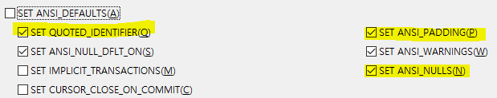
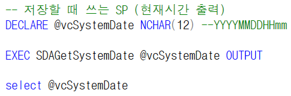
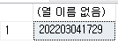
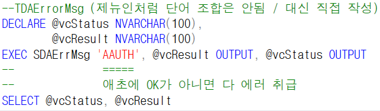
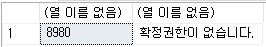
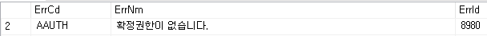

# SP

- ANSI 설정 (Ace와 다름)

<!-- -->

- (옵션 - 쿼리 실행 - SQL Server - ANSI)

- Q,P,N을 꼭 빼줘야함 (SQL 버전도 옛날 버전일 확률이 높기 때문)

> ANSI_NULL
>
> =\> NULL 이 조회되면 에러가 난다
>
> =\> 체크해 놓으면 NULL이 발생하는 데이터에 대해서 무시
>
>  
>
> ==\> N은 체크 해야함
>
>  
>
>  

- +. 바로 적용되는게 아니라 새로 연 창부터 적용

 

저장 =\> Ace는 테이블 단위로 저장해서 1번만 실행하면 되지만

> **GNI는 행 개수만큼 실행한다**
>
>  

삭제 =\> 키 값만 넣어서 삭제하면 된다

 

저장할 때 쓰는 SP

DECLARE @vcSystemDate NCHAR(12) --YYYYMMDDHHmm

 

EXEC SDAGetSystemDate @vcSystemDate OUTPUT

 

select @vcSystemDate

 

 

스플리트하는 SP에서 금액은 'N'을 붙여줘야 에러가 안나고 0이 나온다

금액은 0이 넘어와도 N'0'으로 넘어와야함

 

- 에러 표시

-TDAErrorMsg (제뉴인처럼 단어 조합은 안됨 / 대신 직접 작성)

DECLARE @vcStatus NVARCHAR(100),

@vcResult NVARCHAR(100)

EXEC SDAErrMsg 'AAUTH', @vcResult OUTPUT, @vcStatus OUTPUT

-- =====

-- 애초에 OK가 아니면 다 에러 취급

SELECT @vcStatus, @vcResult

 

 

 

TDAErrorMsg

