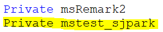
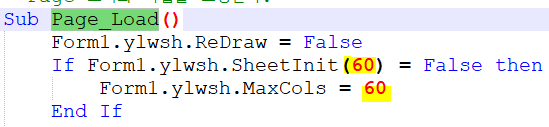
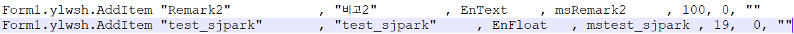
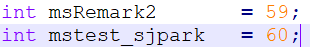
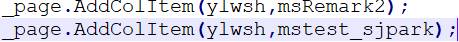
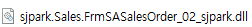
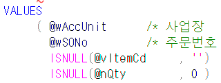
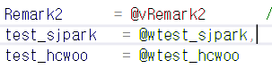
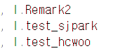

# 시트 컬럼 추가

- 시트 컬럼 추가 (ex. test_sjpark)(58번 서버에서 수정)

1.  ASPX에서 컬럼추가

    1.  Private 변수 선언

> 

2.  Page_Load 컬럼 개수 추가 (59 =\> 60)

> 

3.  Page_Load 하단 부분에 추가

> 
>
>  
>
>  
>
>  

2.  cs 수정

    1.  초기값 할당 (aspx에서 작성한 순서 번호 기입)

> 

2.  Page 추가

> 

 

 

>  

 

3.  csproj에서 컴파일 (Ctrl + Shift + B) =\> bin폴더에 dll 파일 생성 및 복사

> 
>
>  
>
>  
>
>  
>
>  

4.  (1번서버) ksystem.Net - bin 폴더로 dll 파일 붙여넣기 (aspx파일 본인 폴더에 붙여넣기)

 

 

 

>  

저장 및 조회하기 위해 SP 수정

 

1.  SSASalesOrder2Save_02_sjpark

> 
>
>  
>
>  
>
> 
>
>  
>
> 
>
> 
>
>  
>
>  
>
>  
>
>  
>
> 
>
> --------------------------------------------------------------------------------

2.  SSASalesOrder2Qry_sjpark

> 
>
>  
>
> 