# 컨트롤 추가

> 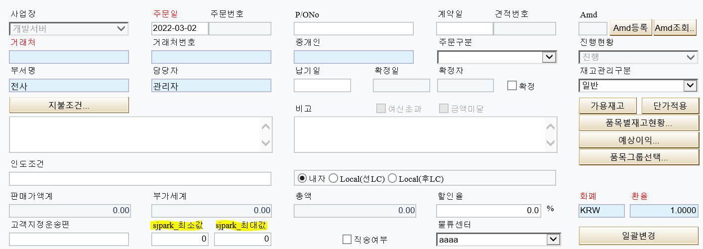
>
>  
>
> \* 컨트롤 영역에 컬럼 추가 (sjpark_최소값 / sjpark_최대값)
>
>  
>
>  
>
>  
>
> 1\. 58번서버 – aspx파일
>
> 디자인 – 컬럼 추가
>
> 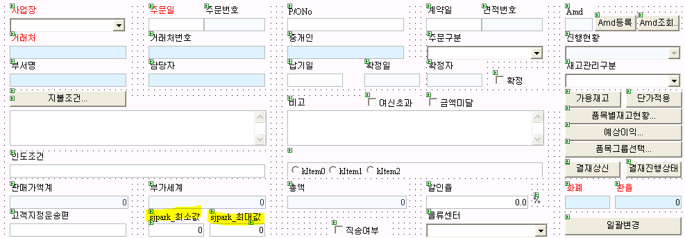
>
>  
>
> ID = fltSjparkFrom / fltSjparkTo
>
> flt =\> float (ex. txt =\> text)
>
> Caption – sjpark_최소값 / sjpark_최대값
>
> 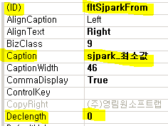
>
>  
>
> Declength – 0 (소수점 개수)
>
>  
>
>  
>
>  
>
>  
>
>  
>
>  
>
>  
>
>  
>
> 2\. HTML 제대로 들어갔는지 확인
>
> 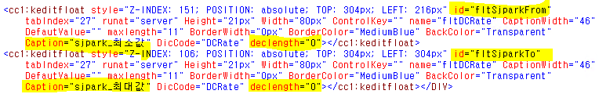
>
>  
>
> \*\* SP에서 데이터를 가져갈 수 있도록 CS에 추가 \*\*
>
> 3\. F7 눌러서 CS파일 열기
>
> 3-1. protected 부분 - fltSjparkFrom / To 추가
>
> 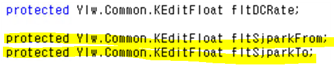
>
>  
>
> 3-2. \_page.AddItem 마찬가지로 From / To 추가
>
> 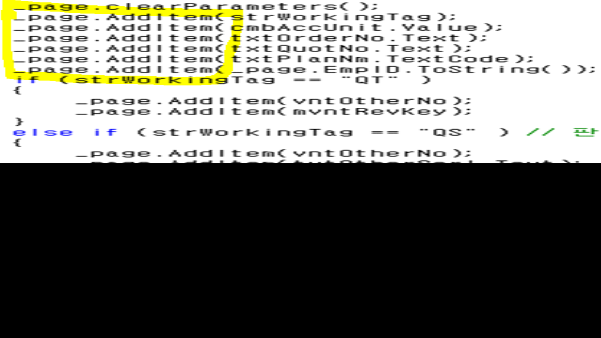
>
>  
>
>  
>
>  
>
>  

- fltSjparkFrom.Text

> Text =\> 일반적인 텍스트
>
> \*\* Value =\> 콤보
>
> \*\* TextCode =\> 코드헬프
>
>  
>
> Ace에서 ‘코드 도움’과 ‘콤보 박스’는 단순히 보여지는 차이 / 원리는 같다
>
> but. GNI에서는 아예 개념이 다르다
>
> ---------------------------------

- GNI

> \* 코드 도움 =\> Ace와 동일 (파란색으로 보임)
>
> 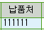
>
>  
>
>  
>
> 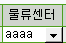
>
> \* GNI 콤보 박스
>
>  
>
> 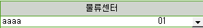
>
> 키 값이 숨어있다 (Ace에서는 콤보, 코드 헬프 둘다 필요 없음)
>
>  
>
>  
>
>  
>
>  
>
>  
>
>   
>
>  
>
> 4\. CS에서 SP로 주는거 2개 추가했으니, SP에서 받는 것도 2개 추가
>
> (SP에서 추가까지 완료해야 값들을 사용할 수 있다)
>
> 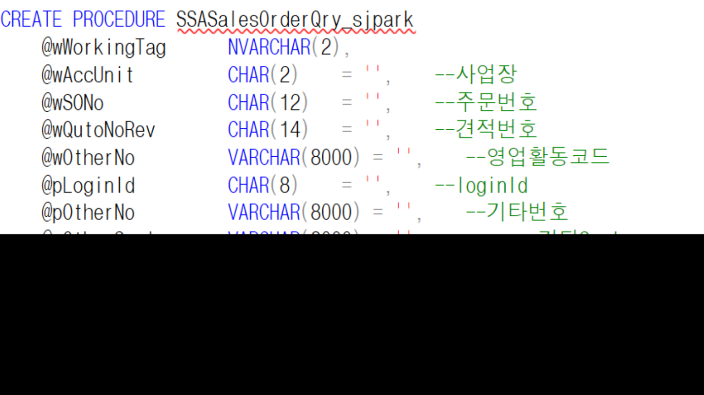
>
>  
>
> \* Ace에서는 CREATE PROCEDURE 부분이 거의 고정되어 있었지만
>
> GNI의 경우 CS부분과 동일해야한다
>
> 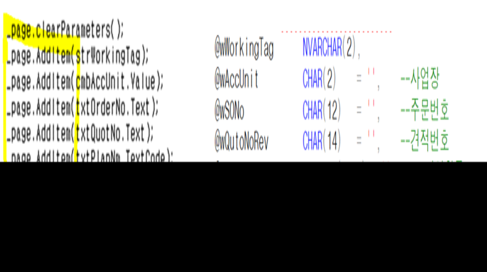
>
>  
>
> 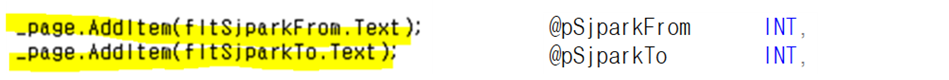
>
>  
>
>  
>
>  
>
>  
>
>  
>
> 5\. END_Proc 부분 수정
>
> 5-1. TSASOM (마스터 테이블)에 test_sjpark부분이 없기 때문에
>
> TSAOItem (아이템 테이블)과 join시켜준다
>
>  
>
> 5-2. 최소값은 상관없지만, 최대값이 0일 때 문제 발생
>
> =\> BETWEEN이 아니라 To 부분에 별도로 조건 추가
>
> =\> 테이블 값이 입력값보다 작을 때
>
> =\> ++. 0이거나 조건도 추가
>
>  
>
> 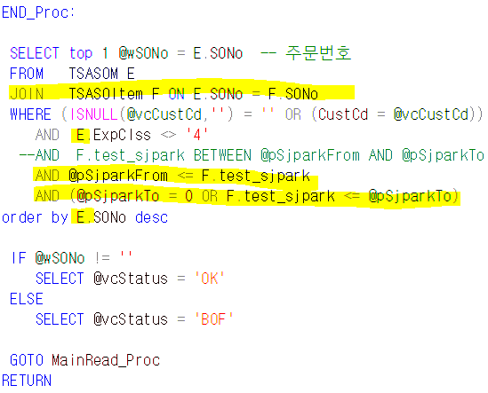
>
>  
>
>  
>
>  
>
>  
>
>  
>
>  
>
> 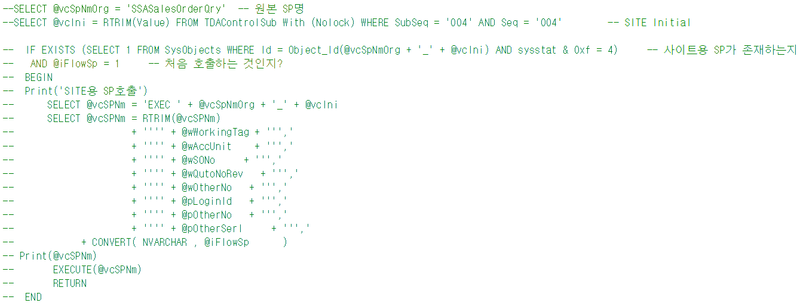
>
>  
>
>  
>
> \~~\_@@ =\> \_@@ 있으면 표준이 아니다
>
> ex. SSASalesOrderQry =\> 표준
>
> ex. SSASalesOrderQry\_ =\> 테스트용
>
>  
>
> 이 부분이 있으면 주석처리 해야한다
>
> 의미 : 표준을 실행하다가 테스트용(\_@@)을 만나면 표준 실행을 중지하고 테스트를 실행
>
> but.
>
> 테스트용 실행 시
>
> 테스트용 실행 =\> 주석 부분 만남 =\> 표준으로 알고 종료 후 다시 테스트용을 실행
>
> =\> 다시 주석 부분 만남
>
> ===\> 무한 루프
>
> ===========================================================================