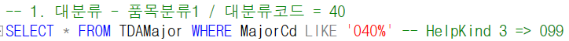
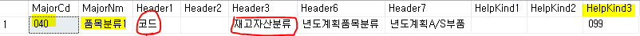
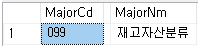
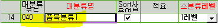
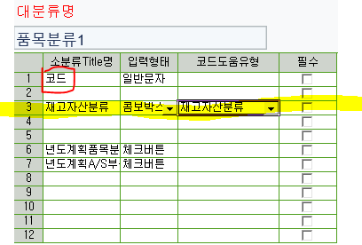
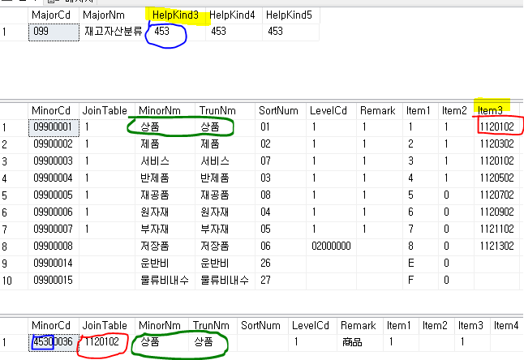

# 대분류 - 소분류

SELECT \* FROM TDAMajor -- 대분류

SELECT \* FROM TDAMinor -- 소분류

SELECT \* FROM TCTCodeHelpMajor -- 코드헬프

-- 테이블안에 추가정보가 다 있다 (단점 : 최대 12개)

-- Major = Header1~12

-- Minor = Item 1~12

 

-- GNI에서는 소스타입이 있다 =\> E, C, T

-- SourceType (거의 E사용)

 

-- E - 사용자정의코드 MinorCd를 키 값으로 조인

-- C - 시스템정의코드 ITEM1을 키 값으로 조인 (MinorCd말고 ITEM1을 키값으로 가져옴)

-- T =\> 다른 테이블에서 들어오는 것

 

 

-- SourceType = C인 경우

 

-- 1. 대분류의 소분류 중에 코드헬프를 쓰는 소분류는 대분류를 조회 했을 때 HelpKind 부분에 값이 있다 (HelpKind 3,4,5,6,7 = 453)

SELECT MajorCd, MajorNm, HelpKind3, HelpKind4, HelpKind5 FROM TDAMajor WHERE MajorCd LIKE '099%'

-- 2. 소분류 - 코드헬프를 쓰는 Item에 코드헬프의 JoinTable값이 있다

SELECT \* FROM TDAMinor WHERE MinorCd LIKE '099%' -- Item 3,4,5,6,7 =\> 1120102 / 4110302 / 4210102 / 1120302 / 4110102 / 4210302

-- 3. 코드헬프 소분류 조회 시 키값 = 대분류(HelpKind) / JoinTable = 소분류(Item) 넣어서 조회

SELECT \* FROM TDAMinor WHERE MinorCd LIKE '453%' AND JoinTable = '1120102'

-- 대분류(HelpKind) =\> 사용할 코드헬프의 키값

-- 소분류(Item) =\> 사용할 코드헬프의 JoinTable값

 

-- SourceType = T인 경우

-- =\> 다른 테이블에서 들어오는 것

-- =\> 다른 등록화면 SP에서 추가입력

-- =\> 코드헬프 못 씀 / 대분류등록에서도 볼 수 없다

 

-- T 예시 (057)

-- TDAMajor : (SourceType = T, MajorNm = 단위) ==\> 단위 테이블에서 값을 가져온다 (단위 테이블 = TDAUnit)

-- TDAMinor

-- JoiniTable =\> UnitCd ==\> 실제 테이블 (단위테이블)의 키 값(UnitCd)

-- MinorNm =\> UnitNm ==\> 실제 테이블 (단위테이블)의 이름 (UnitNm)

-- MinorNm을 선택하면 JoinTable (테이블 키값)이 들어옴

-- 단위 대분류

SELECT \* FROM TDAMajor WHERE MajorCd like '057%'

 

-- 단위 소분류

SELECT \* FROM TDAMinor WHERE MinorCd like '057%'

 

-- 단위 테이블

SELECT \* FROM TDAUnit

 

-- 밑의 과정이 단위 소분류와 같다

SELECT \*

FROM TDAMinor as a

JOIN TDAUnit as b

on a.JoinTable = b.UnitCd

WHERE MinorCd like '057%'

 

 

------------------------------------------------------------------------------------

--대분류 조회 및 추가

--(마스타 및 운영관리) 마스터등록 = 공통마스터 = 대분류등록

 

--\* 대분류 추가 (ex. Q39)

--여유칸이 없으면 DB에서 넣어줘야한다

 

--(대분류)코드 값을 지정해야함 / 숫자로만 된거 =\> 시스템에서 만들어져 있는거

--EX. 새로 만들 때 Q38 =\> Q39으로 만들면된다

 

--만들기전에 검색해야함

SELECT \* FROM TDAMajor WHERE MajorCd like 'Q%'

--추가 검색 유의 사항

SELECT \* FROM TCTCodeHelpMajor WHERE MajorCd LIKE 'Q%'

-- 조회화면 TDAMAJOR에서는 없던 QGC / QGT가 나옴

-- =\> 이 값들은 만들 때 피해줘야한다

 

-- 제일 마지막꺼 복사

-- MajorCd : Q38 -\> Q39

-- SysType : 밑에서 설명

-- MajorNm : T-교육

-- SourceType : E (만든거니까 사용자정의코드인 E사용)

-- RegDate,AddDate : 오늘 날짜로 수정

 

-- 소분류 추가

-- 소분류 title =\> 추가정보 느낌

-- 소분류 등록에서 안보임 =\> SysType를 1로 바꿔줘야 보임 (TDAMajor의 두 번째 컬럼)

-- 각 자리마다 페이지를 가지고 있다

-- (모듈을 알 수 없으므로,

-- 1. 모든 자리를 1로 바꾸거나 2. 연관된 데이터 참조)

 

-- 소분류등록에서 값을 입력하면 ITEM1~ 차례대로 써진다

SELECT \* FROM TDAMinor WHERE MinorCd LIKE 'Q39%'

 

 

 

MajorCd = 40

MajorNm = 품목분류1

Header =\> 소분류 Title명

HelpKind =\> 코드 헬프 (콤보박스, 코드도움 사용할 경우 값이 있다)

> HelpKind3 = 99 =\> 코드도움유형 = ‘재고자산분류’

 

\[마스타 및 운영관리\] - \[마스터등록\] - \[대분류등록\]

 

 

 

 

099 =\> 대분류

453 =\> 코드헬프

453 + 1120102