# 조회모음 SP

> SCTQry_ylwa06002_0307 (구매요청현황)

1.  변수

- 조회모음은 모든 변수가 정해져있다

1-1. @iWorkType

> A,U,D를 사용하는 워크타입이 아님
>
> 조회할 때 조회별로 방식이 다를 수 있기 때문에 사용한다
>
> ex. 사원별로 조회 / 부서별로 조회 등등
>
> @iMajorCd : Major =\> Minor
>
> @iCode : Minor =\> Print
>
> 3개의 SP동시 사용 =\> 분기해야한다

1-2. @iBizUnit (보통 1개로 구성)

> ex. 사업장

1-3. @iDate1~4

> 최대 4개 =\> 굉장히 제한적이다
>
> 
>
> ==\> 이미 2개 사용

1-4. @i1stCond

> 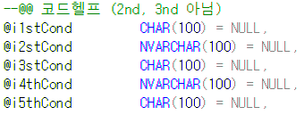
>
> 마찬가지로 5개까지만 사용 가능
>
> 2nd, 3nd가 아니라 2st, 3st로 되어 있다
>
> 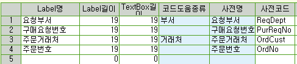
>
> ==\> \* 조회모음등록 (마스타 및 운영관리) - 운영관리 - 조회모음 - 조회모음등록
>
> 코드헬프 설정 및 위치 지정
>
> 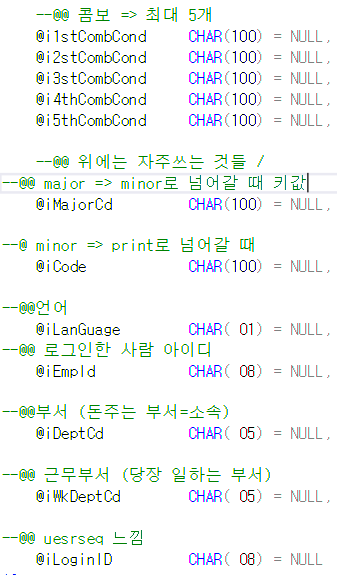
>
>  
>
> --@@ 안 쓰는 부분들은 주석처리 (나중에 수정 시, 다른 사람이 쓸 때 편하도록)
>
> -- EXEC SDABOMControlQty @iBOMQty OUTPUT
>
> -- EXEC SDAItemControlQty @iItemQty OUTPUT , /\* 자재 수량 \*/
>
> -- @iItemWonAmt OUTPUT , /\*자재 원화 \*/
>
> -- @iItemForAmt OUTPUT /\*자재 외화 \*/
>
> EXEC SDAGoodsControlQty @iGoodsQty OUTPUT , /\* 수량 \*/
>
> @iWonAmt OUTPUT , /\*제품 원화 \*/
>
> @iForAmt OUTPUT /\*제품 외화 \*/
>
>  
>
> 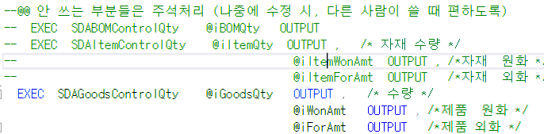
>
>  
>
>  
>
>  
>
>  
>
>  
>
>  
>
> --@@ 화면에서 값을 줄 때 이상하게 올 수도 있음
>
> --@@ =\> 이 문제를 해결하는 부분 =\> 공백없애기
>
> SELECT @iMajorCd =ISNULL(LTRIM(RTRIM(@iMajorCd)),''),
>
> @iCode =ISNULL(LTRIM(RTRIM(@iCode)),''),
>
>  
>
> 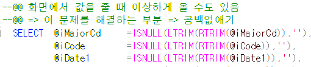
>
>  
>
>  
>
>  
>
>  
>
> --@@ 누르면 각각 해당하는 PROC 로 간다
>
> --@@ 하나의 PROC마다 다 작성이 되어있음
>
> --@@ 마지막 RETURN =\> 다른건 안쓴다
>
> IF @iWorkType = 'TITLE' GOTO Title_Proc --@@ 무조건있음
>
> ELSE IF @iWorkType = 'MAJOR' GOTO Major_Proc --@@ 조회
>
> ELSE IF @iWorkType = 'MINOR' GOTO Minor_Proc
>
> ELSE IF @iWorkType = 'DETAIL' GOTO Detail_Proc --@@ 만약 시트가 3개일경우 =\> MINOR =\> MAJOR
>
> ELSE IF @iWorkType = 'PRINT' GOTO Print_Proc
>
>  

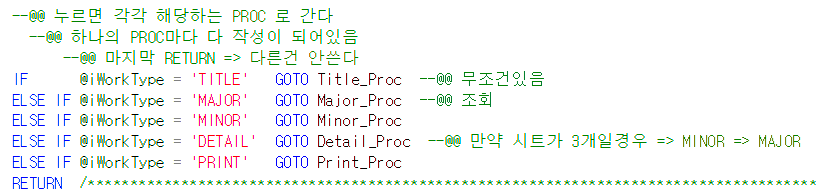

기본적인 틀

1.  변수 선언 (거의 고정)

> +. 색깔 선언

2.  선언한 것들 공백 제거

3.  iWorkType if문

- 해당하는 PROC로 이동

4.  Title_Proc

- 임시테이블 작성 (#Tmp_Qry)

- 컬럼 작성 (INSERT)

- JUMP시 필요한 값들도 여기 작성

5.  Major_Proc

- 날짜, 점프관련, 조회결과

6.  Minor_Proc

7.  Detail_Proc

8.  Print_Proc

- 프린트는 순서에 따라 저장하는게 아니라

> 다른 프로그램을 쓰기 때문에
>
> 무조건 alias를 붙여야한다

Title_Proc:

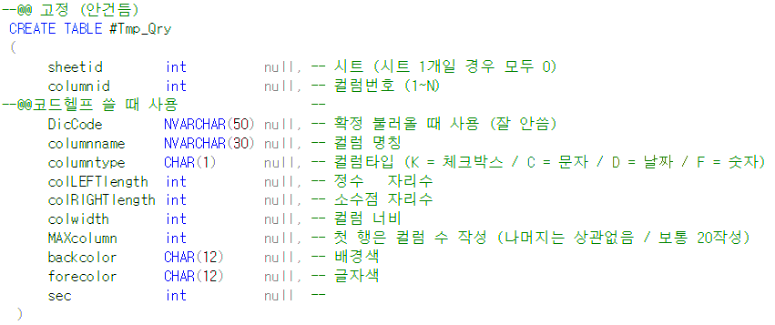

--@@ 고정 (안건듬)

CREATE TABLE \#Tmp_Qry

(

sheetid int null, -- 시트 (시트 1개일 경우 모두 0)

columnid int null, -- 컬럼번호 (1~N)

--@@코드헬프 쓸 때 사용 --

DicCode NVARCHAR(50) null, -- 확정 불러올 때 사용 (잘 안씀)

columnname NVARCHAR(30) null, -- 컬럼 명칭

columntype CHAR(1) null, -- 컬럼타입 (K = 체크박스 / C = 문자 / D = 날짜 / F = 숫자)

colLEFTlength int null, -- 정수 자리수

colRIGHTlength int null, -- 소수점 자리수

colwidth int null, -- 컬럼 너비

MAXcolumn int null, -- 첫 행은 컬럼 수 작성 (나머지는 상관없음 / 보통 20작성)

backcolor CHAR(12) null, -- 배경색

forecolor CHAR(12) null, -- 글자색

sec int null --

)

 

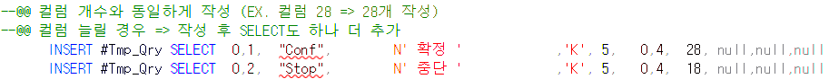

> .
>
> .
>
> .

==\> 총 28개

INSERT \#Tmp_Qry SELECT 0,1, "Conf", N' 확정 ' ,'K', 5, 0,4, 28, null,null,null

INSERT \#Tmp_Qry SELECT 0,2, "Stop", N' 중단 ' ,'K', 5, 0,4, 18, null,null,null

 

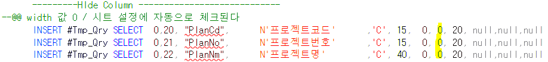

---------HIde Column ----------------------------

--@@ width 값 0 / 시트 설정에 자동으로 체크된다

 

 

 

 

**Major_Proc**

--@@ 점프화면 등록

--@@ 마스터 및 운영관리 - 운영관리 - 프로그램 - Jump항목 등록

--@@ 구매요청현황 =\> 구매요청으로 점프

--@@ 이 세팅을 안해주면 개발한 입력하면으로 점프하는게 아니라 표준 입력화면으로 점프한다

SELECT @wJumpPgm = MAX(JumpPgmID) --@@ JumpPgmID =\> 'frmUGPOReq%' 중 가장 긴 것 가져옴

FROM TCTJumpList

WHERE PgmId = 'ylwa06002' AND JumpPgmID LIKE 'frmUGPOReq%'

--@@ 조회모음 점프할Pgm

 

--@@ 없으면 표준으로 이동

IF ISNULL(@wJumpPgm,'') = '' SELECT @wJumpPgm = 'frmUGPOReq'

 

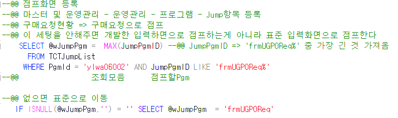

 

**조회 결과 =\> 컬럼 전체 갯수 + total(배경색, 글자색)**

> **ex. 컬럼 28개일 경우 =\> 총 30개 나와야한다**

**조회 결과1**

--@@ C,D,S =\> 확정 중단 선택

--@@ 조회모음이지만 확정, 중단, 선택이 필요할 수 있다 =\> 처리 (완료,중단)을 위해 작성

--@@ Total 부분에 T를 넣을 경우 해당 컬럼에 대한 합계가 나온다)

SELECT 'C','D','S','','',

'' ,'' ,'' ,'','',

--10

'' ,'' ,'' ,'','',

'' ,'' ,'' ,'','',

--20

'' ,'' ,'' ,'','',

--25

'' ,@빨강1,@하양,

--@@ ==\> 28개

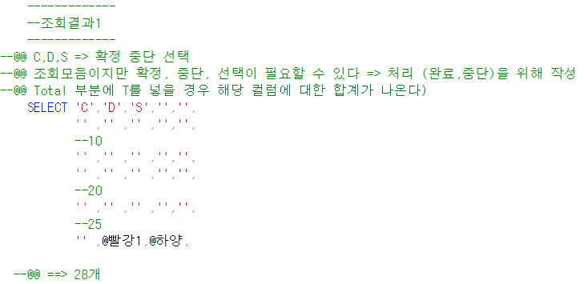

 

**Print_Proc**

--@@ 데이터셋 하나만 받아서 쓰기 때문에 조회결과1이 필요가 없다 / 색깔, 점프할 때 쓰는 부분도 필요 없다 (\_/있는 부분)

--@@ 이렇게 두 개 지우고 majorproc 써도된다

--@@ 프린트는 순서가 아니라 다른 프로그램을 쓰기 때문에 무조건 alias 붙여야한다

 

 

 

aspx 필기