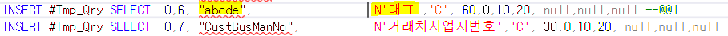
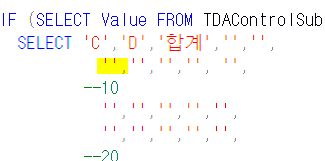
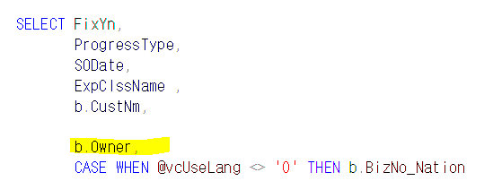

# 조회모음 컨트롤 추가

1.  임시테이블에 INSERT

    1.  0 =\> 시트 번호 (1개라 전부 0)

    2.  6 =\> 컬럼 순서 (중요)

    3.  abcde =\> 아무렇게나 써도 상관 없음

    4.  대표 =\> 컬럼타입 (K = 체크박스 / C = 문자 / D = 날짜 / F = 숫자)

> 
>
> 

 

>  

2.  SELECT 문에 추가

> 대표 =\> 6번째 였기 때문에 6번째에 추가
>
> 

3.  PgmID 변경

 

4.  마지막 SELECT문에 추가

>