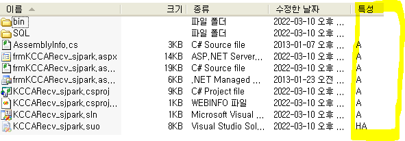
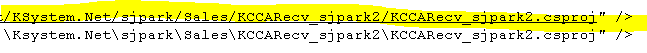
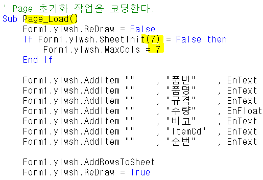
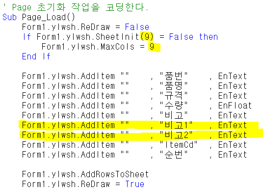
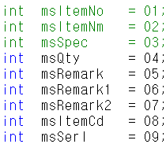

# 사이트 작업 및 초기설정

- 23.11.08

1.  경로 폴더를 만듬

2.  aspx, cs , csproj, webinfo 4개 파일 읽기 전용 해제 후 노트패드로 모두 열기

3.  cs 파일 수정

 

 

>  

- 사이트 작업 - 기존에 있던 사이트를 이용해서 만들기

1.  경로, 폴더 만들기

- D:\Ksystem.Net\sjpark \Sales\KCCARecv_sjpark

- \\ 닷넷 \사이트이니셜\모듈\명칭

2.  파일 옮기기 / bin폴더는 삭제 / 읽기전용 체크 해제

> +. 특성 체크 (RA =\> 읽기전용 / A =\> 읽기전용 x
>
> ==\> 체크아웃 / 체크인 알 수 있다
>
> 

3.  파일명 바꾸기 / 파일 수정

> aspx, cs, csproj, webinfo 총 4개 수정
>
> +. resx는 다른곳에 있는거 써도 되지만 명칭은 맞춰줘야함
>
> 먼저 webinfo 수정 (경로 변경)
>
> ++. 경로 수정할 때 주소 복사하면 \이기 때문에 복사 x (webinfo 파일은 / 로 구분되어있음)
>
> 

 

- csproj 수정

<!-- -->

- aspx, cs, webinfo 등 실행할 파일들의 경로가 담겨져있다

- assemblyname / rootnamespace 변경

<!-- -->

- aspx 수정

<!-- -->

- 맨 위에 경로명 수정

> 
>
> 
>
>  

- 출력물 SP명도 있다

<!-- -->

- cs 수정

<!-- -->

- 경로명

- SP명 변경

 

- SP도 수정

>  

4.  실행해보기

- csproj 실행 =\> 프로그램 잘열리는지 확인

- 빌드 (Ctrl + Shift + B =\> dll 파일 (csproj- assemblyname을 따라서 만들어짐)

- dll 파일 1번서버에 옮김, aspx도 옮김 (dll - 서버에서 작동하는 파일)

> 원격없이 옮기기
>
> 주소창에 입력 : [\\61.250.183.1\d](file://61.250.183.1/d)
>
>  

 

====================================================================================================================================================================================================

1.  폼등록

마스타 - 운영관리- 프로그램 - 폼등록

**폼ID / 폼명 / 폼 파일명 / URL 수정** (나머지는 복사 붙여넣기 해도된다)

엔터키가 들어가 있을수 있으므로 작성하기전에 다 지워야함

../../../ = ksystem.net

 

2.  권한

마스타 - 운영관리 - 사용자 - 프로그램별 사용자 등록

사용자 - super

사업장권한 - all 이 좋음

 

3.  메뉴 등록

마스타 - 운영관리 - 모듈 - 메뉴등록

==================================== 까지가 첫 단계 (화면 띄우기 용)

컨트롤, 시트 컬럼 추가하기 (비고1, 비고2)

1.  csproj 실행

 

2.  aspx - 디자인

- 컨트롤 추가

- 속성 변경 (ID, Caption)

 

3.  aspx - HTML

- 추가한 컨트롤 자동으로 들어있는지 확인

- Private 부분에서 시트 추가할 부분 추가

- Page_Load 전체 갯수 추가 (시트 추가한 만큼)

**\*\*\* 순서가 중요 / 시트 전체 갯수 만큼 숫자 입력**

- 변경 전

>  

- 변경 후

 

4.  cs 수정

- Body 부분 수정 (순서가 중요)

> 

 

밑에 \_page.Additem 부분에서

\[msRemark1\]이 들어가는게 아니라 순서인 6이 들어간다

(알아보기 편하게 msRemark1 이라고 작성한 것)

5.  컴파일 후 aspx, dll 파일 1번서버로 옮기기

<!-- -->

6.  SP도 수정