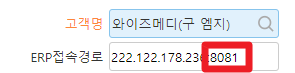
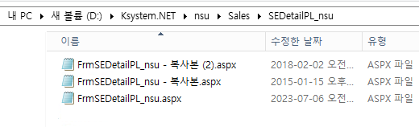
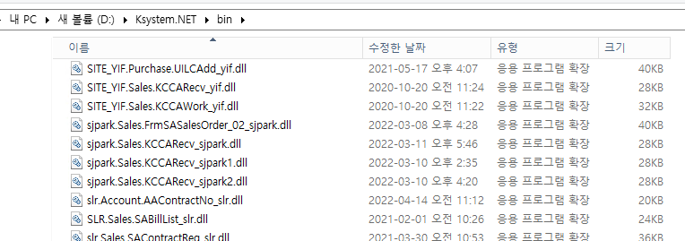

# 1번 GNI 패치 위치

F:\Ksystem.net\bin

F:\Ksystem.net\ULV\Pay\YPCarMileageReg_ulv

=\> 포트 8080 =\> D 드라이브

=\> 포트 8081 =\> F 드라이브

(확실하진 않음 -\> 확인할 때 포트번호 주의해서 ERP 접속

 

1.  aspx

    1.  D:\Ksystem.NET\nsu\Sales\SEDetailPL_nsu

> 

2.  dll

    1.  D:\Ksystem.NET\bin

> 
>
>