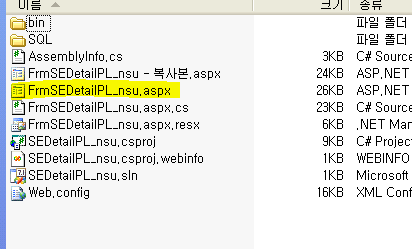
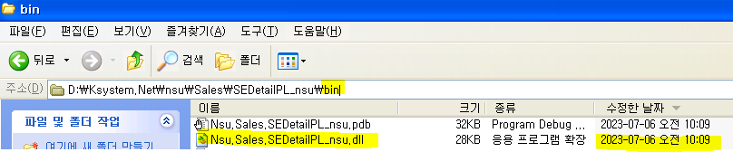

# 주의사항

58번 파일 위치

D - Ksystem.Net =\> GNI

D - Ksystem.New =\> Smart

 

원격 접속 시 끄기전에 켜놓았던 프로그램들 끄기

 

소스세이프 폴더 째로 체크아웃

 

aspx는 실서버에서 가져오는게 좋음 (일단 그전에 소스세이프랑 비교)

 

 

 

 

1.  .csproj 파일 열기

2.  오른쪽 aspx 더블클릭해서 화면단 볼 수 있음 (시트 x)

3.  우클릭 - HTML 소스보기 - aspx 소스 볼 수 있다

4.  F7 눌러서 cs 파일 열기

5.  F5 누르면 dll 파일 생성

6.  aspx 파일 / bin - dll 파일 두개 옮겨야함

 

