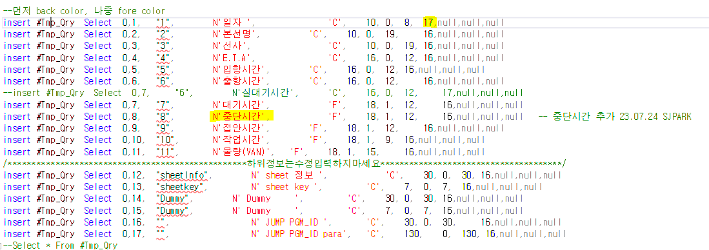

# 조회모음 컬럼 추가

1.  \#Tmp_Qry d INSERT 추가

    1.  맨 처음 컬럼 (ex.17) 이 전체 컬럼 갯수이기 때문에 추가한 갯수 만큼 늘려줘야함 (맨 위에만 해도 된다)

 

 

-- 컬럼 추가한 위치에 추가해야함

 

2.  TCTQrySheet 에 조회모음에 해당하는 값 삭제

    1.  ex. DELETE from TCTQrySheet WHERE pgm_id = 'ylwa05102_juct'

    2.  삭제 후 sp 실행하면 자동으로 다시 insert 된다

 

3.  erp 에서 실행 시 DB에서는 정상적으로 작동하는데

> exec SCTQry_ylwa05102_juct ~ 이런 식으로 에러가 난다면 sp 카탈 후 다시 실행하면 된다
>
>  
>
>