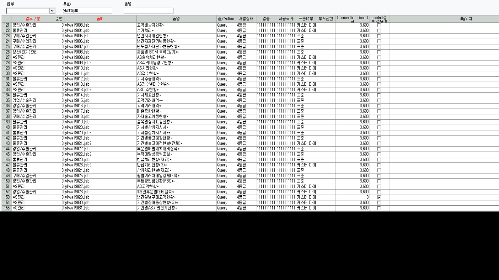

# 조회모음 신규

1.  폼등록

> 
>
>  

2.  조회모음등록

> 
>
>  

3.  프로그램별 사용자등록 - 관리자

4.  메뉴등록 - 어차피 권한 있는 사람한테 밖에 안보임

5.  sp 작성 SCTQry_ylwa19303_jsb

    1.  sp 작성 시 맨 위에 DELETE FROM TCTQrySheet WHERE pgm_id = 'ylwa19303_jsb' 구문 추가하기 (그래야 다음 수정 때 편리함)

    2.  total 행 추가 시 컬럼 갯수 맞춰야함 / 컬럼 갯수 + @꽃분홍1, @하양

    3.  소수점은 sp에서 설정

    4.  숨기는 기능 ? =\> 그냥 컬럼길이 0 으로 하거나 아예 삭제

    5.  일자는 그냥 substring으로 하자

>