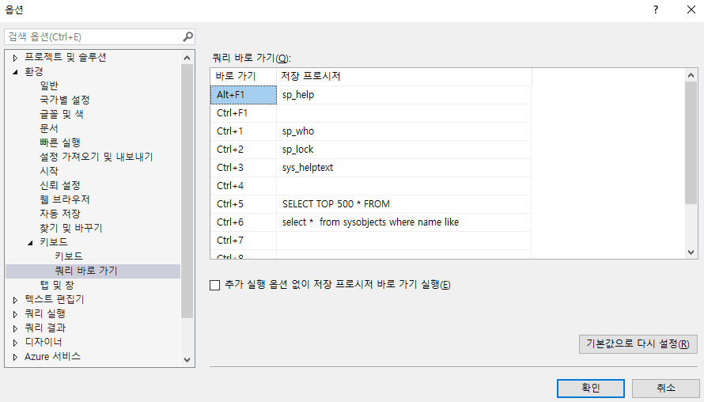

# 쿼리 바로 가기

 

sys_helptext

sp_help

sp_who

sp_lock

 

 

3~9

sys_helptext

SSPPARAM

SELECT TOP 500 \* FROM

select \* from sys.objects where name like

SELECT \* FROM INFORMATION_SCHEMA.ROUTINES WHERE ROUTINE_TYPE = 'PROCEDURE' AND SPECIFIC_NAME LIKE

sp_spaceused

SP_HELPINDEX