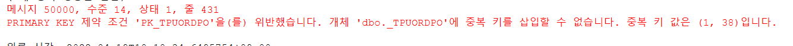

# Max값 update

 

 

--저장 시 중복 키 에러

--=\> 마이그레이션 (덮어쓰는 과정)에서 max값이 제대로 안 들어간 경우

-- MAX 값 업데이트 해줘야한다

-- MAX 채번 테이블 MAX값 확인

SELECT \* FROM \_TCOMCreateSeqMax WHERE TableName = '테이블명'

-- 실제 MAX값 확인

SELECT MAX(테이블키)

FROM 테이블명

 

SELECT \*

FROM 테이블명

WHERE 테이블키 = 1001

-- 실제 MAX값으로 업데이트

UPDATE \_TCOMCreateSeqMax

SET MaxSeq = 1001

WHERE TableName = '테이블명'