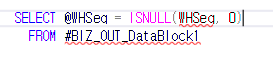

# 체크 SP 주의사항

중복체크

 

----====================================--

---- 중복여부체크(PalletSeq이 2개 이상일 경우)

----====================================--

---- 중복체크Message 받아오기

EXEC dbo.\_SCOMMessage @MessageType OUTPUT,

@Status OUTPUT,

@Results OUTPUT,

6 , -- 중복된@1 @2가(이) 입력되었습니다.(SELECT \* FROM \_TCAMessageLanguage WHERE MessageSeq = 6)

@LanguageSeq ,

0,'' -- SELECT \* FROM \_TCADictionary WHERE Word like '%구매카드번호%'

 

--========================================--

-- 이미저장된시트에서중복되는것있는지확인 --

--========================================--

UPDATE A

SET Result = @Results ,

MessageType = @MessageType ,

Status = @Status

FROM \#BIZ_OUT_DataBlock2 AS A

JOIN gcos_TLGHighRackOutItem AS B ON

A.ItemSeq = B.ItemSeq

AND A.MDSeq = B.MDSeq

AND A.RackSeq = B.RackSeq

AND A.LotNo = B.LotNo

AND A.Serl \<\> B.Serl

AND A.RackOutSeq = B.RackOutSeq -- 중복 컬럼이 추가 될수록 똑같이 조건 넣어주기

WHERE A.WorkingTag IN ('A','U')

AND A.Status = 0

AND B.CompanySeq = @CompanySeq

--========================================--

-- 같은저장시트에서중복되는것이있는지확인 --

--========================================--

UPDATE A

SET Result = @Results ,

MessageType = @MessageType ,

Status = @Status

FROM \#BIZ_OUT_DataBlock2 AS A

JOIN \#BIZ_OUT_DataBlock2 AS B ON A.IDX_NO \<\> B.IDX_NO

AND A.ItemSeq = B.ItemSeq

AND A.MDSeq = B.MDSeq

AND A.RackSeq = B.RackSeq

AND A.LotNo = B.LotNo

AND A.RackOutSeq = B.RackOutSeq -- 중복 컬럼이 추가 될수록 똑같이 조건 넣어주기

WHERE A.WorkingTag IN ( 'A','U' )

AND A.Status = 0

 

--===============================

저장 SP 에서 같이 체크 해도 상관 없음

 

가급적이면 @변수 안쓰기

 

테이블에서 데이터 가져올 때는 ISNULL 처리

 

체크 시

WorkingTag, Status는 필수

+. Join 걸 때 CompanySeq 도 넣기

 

 

UPDATE A

SET Result = '중복된 일자 구간이 입력되었습니다.' ,

MessageType = @MessageType ,

Status = @Status

FROM \#BIZ_OUT_DataBlock1 AS A

JOIN \#BIZ_OUT_DataBlock1 AS B ON B.StartYM \<= A.EndYM

AND B.EndYM \>= A.StartYM

AND B.IDX_NO \<\> A.IDX_NO

WHERE A.WorkingTag IN ('U')

AND A.Status = 0

AND B.CompanySeq = @CompanySeq