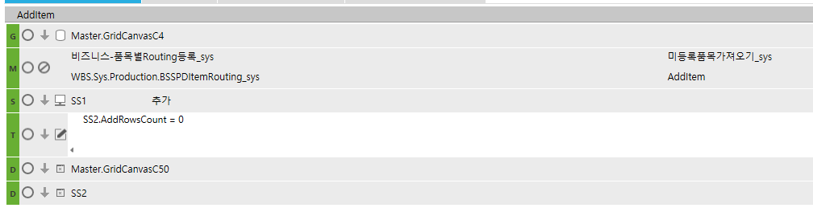

# 미등록 품목 가져오기

미등록 품목 가져오기

sys_SWPDItemRoutingQuery

상품

버튼 클릭 시, 왼쪽 쉬트에 아직 Routing이 연결안된 품목(제품, 반제품)을 모두 가져와서 나타냅니다.

+. 처음이 아니라 추가로 설정

 

DROP PROC sys_SWPDNotConnectRoutingQuery

GO

CREATE PROC sys_SWPDNotConnectRoutingQuery

@ServiceSeq INT = 0,

@WorkingTag NVARCHAR(10)= '',

@CompanySeq INT = 1,

@LanguageSeq INT = 1,

@UserSeq INT = 0,

@PgmSeq INT = 0,

@IsTransaction BIT = 0

AS

DECLARE @ItemName NVARCHAR(200),

@ItemNo NVARCHAR(100)

 

SELECT @ItemName = ISNULL(ItemName,''),

@ItemNo = ISNULL(ItemNo ,'')

FROM \#BIZ_IN_DataBlock1

SELECT ISNULL(A.ItemName,'') AS ItemName,

ISNULL(A.ItemNo ,'') AS ItemNo ,

ISNULL(A.Spec ,'') AS Spec

FROM \_TDAITem AS A LEFT OUTER JOIN SYS_TPDItemRouting AS B ON A.ItemSeq = B.ItemSeq

WHERE B.CompanySeq IS NULL

AND (@ItemName = '' OR A.ItemName LIKE '%' + @ItemName + '%')

AND (@ItemNo = '' OR A.ItemNo LIKE '%' + @ItemNo + '%')

AND A.AssetSeq IN (SELECT A.AssetSeq

FROM \_TDAItemAsset AS A WITH(NOLOCK)

WHERE A.SMAssetGrp IN (6008002,6008004))

AND A.CompanySeq = @CompanySeq

RETURN

 

