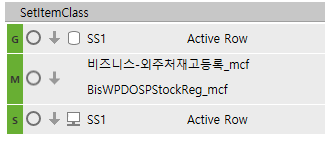

# codehelpafter

mcnk_SWACLoanUsanceSetLoanSeq

 

mcnv_SXPRWkGetEmpWkTypeQuery

 

운전자금(유산스)등록

일자별근무내역_mcnv

장려금기준등록_hsg

추가정보가져오기

SELECT A.MinorName

FROM \_TDAUMinor AS A WITH(NOLOCK)

JOIN \_TDAUMinorValue AS B WITH(NOLOCK) ON A.CompanySeq = B.CompanySeq

AND A.MinorSeq = B.ValueSeq

AND B.MajorSeq = 1000394

WHERE @UMCity = B.MinorSeq

 

for row=0,SS1.DataRowCnt-1 do

> SS1.ActiveRow = row
>
> RunPgmMethod('SetItemClass')
>
>  

end

=\>