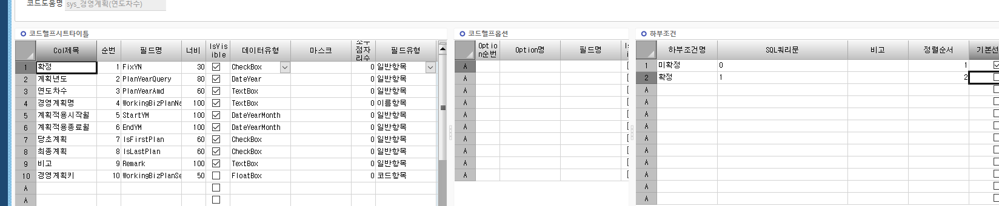

# 코드도움 주의사항, 코드도움 추가 조건

DROP PROCEDURE dbo.sys_SWCACodeHelpBasePlan

GO

CREATE PROCEDURE dbo.sys_SWCACodeHelpBasePlan

@WorkingTag varchar(1),

@LanguageSeq INT,

@CodeHelpSeq INT,

@DefQueryOption INT,

@CodeHelpType INT,

@PageCount INT = 20,

@CompanySeq INT = 1,

@Keyword nvarchar(100)='',

@Param1 nvarchar(50)='',

@Param2 nvarchar(50)='',

@Param3 nvarchar(50)='',

@Param4 nvarchar(50)='',

@ConditionSeq nvarchar(200)=''

AS

--EXEC \_SYMMETRICKeyOpen

SET ROWCOUNT @PageCount

SELECT ISNULL(A.FixYN ,'') AS FixYN , -- 확정

ISNULL(A.PlanYear ,'') AS PlanYearQuery , -- 계획년도

ISNULL(A.PlanYearAmd ,'') AS PlanYearAmd, -- 연도차수

ISNULL(A.BizPlanSeq ,'') AS WorkingBizPlanSeq , -- 경영계획키

ISNULL(A.BizPlanName ,'') AS WorkingBizPlanName, -- 경영계획명

ISNULL(A.StartYM ,'') AS StartYM , -- 계획적용시작월

ISNULL(A.EndYM ,'') AS EndYM , -- 계획적용종료월

ISNULL(A.IsFirstPlan ,'') AS IsFirstPlan, -- 당초계획

ISNULL(A.IsLastPlan ,'') AS IsLastPlan , -- 최종계획

ISNULL(A.Remark ,'') AS Remark -- 비고

FROM SYS_TBPYearAmd AS A WITH(NOLOCK)

WHERE A.CompanySeq = @CompanySeq

AND (@ConditionSeq = '' OR

(@ConditionSeq = '0' AND ISNULL(A.FixYN, '') \<\> '1') OR

(@ConditionSeq = '1' AND ISNULL(A.FixYN, '') = '1')

)

AND A.BizPlanName LIKE @Keyword + N'%'

SET ROWCOUNT 0

RETURN

 

-- ISNULL(A.FixYN, '') \<\> '1'

-- ISNULL(A.FixYN, '') = '1'

 

