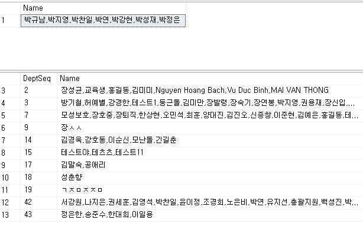
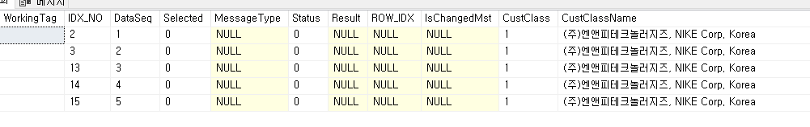

# 

-- 문자열 합치기

SELECT DISTINCT

STUFF((

SELECT ',' + EmpName

FROM \_TDAEmp

WHERE EmpName LIKE '박%'

FOR XML PATH('')

),1,1,'') AS Name

FROM \_TDAEmp AS TEST

 

 

-- 부서별로 그룹지어 출력하기

SELECT DISTINCT DeptSeq,

STUFF((

SELECT ',' + EmpName

FROM \_TDAEmp

--WHERE EmpName LIKE '박%'

WHERE DeptSeq = TEST.DeptSeq

FOR XML PATH('')

),1,1,'') AS Name

FROM \_TDAEmp AS TEST

--WHERE EmpSeq \>=400

 

DECLARE @CustClassName NVARCHAR(1000)

 

SELECT @CustClassName = STUFF((SELECT DISTINCT ', ' + Z.CustName

FROM \#BIZ_OUT_DataBlock1 AS A

JOIN \_TDACust AS Z WITH(NOLOCK) ON Z.CompanySeq = @CompanySeq

AND Z.CustSeq = A.CustSeq

LEFT OUTER JOIN \_TDACustClass AS B WITH(NOLOCK) ON B.CompanySeq = @CompanySeq

AND B.UMajorCustClass = 2140260

AND B.CustSeq = A.CustSeq

LEFT OUTER JOIN \_TDAUMinor AS D WITH(NOLOCK) ON B.CompanySeq = D.CompanySeq

AND B.UMCustClass = D.MinorSeq

LEFT OUTER JOIN \_TDAUMinorValue AS E WITH(NOLOCK) ON E.CompanySeq = D.CompanySeq

AND E.MinorSeq = D.MinorSeq

AND E.Serl = 15000001

WHERE E.ValueText = '1'

FOR XML PATH('')),1,2,'')

 

--================================================================================================================

-- 시작 / \[출고지시서입력(OEM,CKD/AS)\_sdng\] 화면에 단가 등록 안된 경우 에러처리 및 해당 거래처,품목 출력 24.07.22 SJPARK

--================================================================================================================

DECLARE @DelvOrderDate NCHAR(8)

,@ErrorList NVARCHAR(MAX)

 

SELECT @DelvOrderDate = A.DelvOrderDate

FROM \#BIZ_OUT_DataBlock1 AS A

 

SELECT @ErrorList = STUFF((SELECT DISTINCT ', ' + '\['+G.CustName +' / '+ C.ItemNo + '\]'

FROM \#BIZ_OUT_DataBlock2 AS A

LEFT OUTER JOIN sdng_TSLSalesCustItemPrice AS B WITH(NOLOCK) ON B.CompanySeq = @CompanySeq

AND B.ItemSeq = A.ItemSeq

AND B.CustSeq = A.CustSeq

AND B.UnitSeq = A.UnitSeq

AND @DelvOrderDate BETWEEN B.SDate AND B.EDate

--AND B.CurrSeq = A.CurrSeq

LEFT OUTER JOIN \_TDAItem AS C WITH(NOLOCK) ON C.CompanySeq = @CompanySeq

AND C.ItemSeq = A.ItemSeq

LEFT OUTER JOIN \_TDAUnit AS D WITH(NOLOCK) ON D.CompanySeq = @CompanySeq

AND D.UnitSeq = A.UnitSeq

LEFT OUTER JOIN \_TDACust AS G WITH(NOLOCK) ON G.CompanySeq = @CompanySeq

AND G.CustSeq = A.CustSeq

WHERE B.CompanySeq IS NULL

FOR XML PATH('')),1,2,'')

 

IF ISNULL(@ErrorList,'') \<\> ''

BEGIN

UPDATE A

SET Result = @ErrorList + ' 등록되어 있지 않습니다.',

MessageType = 17009,

Status = 9999

FROM \#BIZ_OUT_DataBlock2 AS A

LEFT OUTER JOIN sdng_TSLSalesCustItemPrice AS B WITH(NOLOCK) ON B.CompanySeq = @CompanySeq

AND B.ItemSeq = A.ItemSeq

AND B.CustSeq = A.CustSeq

AND B.UnitSeq = A.UnitSeq

AND @DelvOrderDate BETWEEN B.SDate AND B.EDate

--AND B.CurrSeq = A.CurrSeq

WHERE A.WorkingTag IN ('A','U')

AND B.CompanySeq IS NULL

END

 

 

 

--================================================================================================================

-- 종료 / \[출고지시서입력(OEM,CKD/AS)\_sdng\] 화면에 단가 등록 안된 경우 에러처리 및 해당 거래처,품목 출력

--================================================================================================================