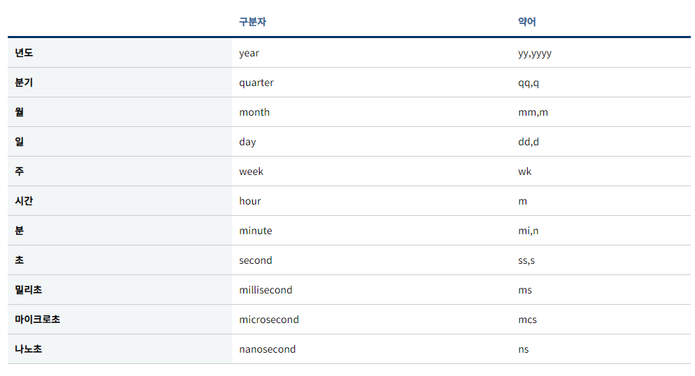

# 날짜 계산 식

날짜 비교

현재일보다 큰 날짜만 출력

WHERE

해당 월의 마지막 날짜 구하기 =\> YYYY-MM-DD 형식으로 나옴

SELECT EOMONTH('2020.02.09') AS result

SELECT EOMONTH('2021-02-09') AS result

SELECT EOMONTH('20220209') AS result

 

 

-- EOMONTH 함수 없는 서버도 있음

DECLARE @SalesYM NCHAR(6)

,@DateFr NCHAR(8)

,@DateTo NCHAR(8)

,@SalesYMD NCHAR(8)

 

,@SalesDateTime DATE

SELECT @SalesYM = '202302'

SELECT @SalesYMD = @SalesYM + '01'

 

SELECT @SalesDateTime = CONVERT (DATE, @SalesYMD)

SELECT @SalesDateTime

 

SELECT CONVERT(NVARCHAR(8),CAST(LEFT(CONVERT(NVARCHAR, @SalesDateTime, 112), 6) +'01' AS DATE) ,112)

,CONVERT(NVARCHAR(8),DATEADD(D, -1, CAST(LEFT(CONVERT(NVARCHAR, DATEADD(M, 1, @SalesDateTime),112),6) + '01' AS DATE)),112)

 

=====================================================================================

 

 

 

 

- 전년도 1월, 12월 구하기

전년도 : CONVERT(NCHAR(4), DATEADD(Y, -1, @StdYY + '0101'), 112)

ex. 2022 -\> 2021 구하기

SELECT @PreDateMMFr = CONVERT(NCHAR(4), DATEADD(Y, -1, LEFT(@SalesYM,4) + '0101'), 112) + '01'

SELECT @PostDateMMFr = CONVERT(NCHAR(8),DATEADD(DAY, -1, LEFT(@SalesYM,4)+'0101'),112)

 

 

 

 

날짜차이

**SELECT** DATEDIFF('구분자','Start_Date','End_Date')

 

**SELECT** DATEDIFF(dd,'2018-01-01','2018-12-31') + 1

 

 

 

 

 

날짜 더하기

EX. 하루 더하기

CONVERT(NCHAR(8),DATEADD(DAY, 1, @A),112)

 

> <https://gent.tistory.com/577?category=874679>

1.  [날짜 요일 구하기](https://gent.tistory.com/577?category=874679#h3_1)

2.  [년, 월, 일 추출하기](https://gent.tistory.com/577?category=874679#h3_2)

3.  [시, 분, 초 추출하기](https://gent.tistory.com/577?category=874679#h3_3)

4.  [분기 구하기](https://gent.tistory.com/577?category=874679#h3_4)

5.  [일 년 기준으로 일수 구하기](https://gent.tistory.com/577?category=874679#h3_5)

6.  [일 년 기준으로 몇 주인지 구하기](https://gent.tistory.com/577?category=874679#h3_6)

>  
>
>  
>
>  
>
>