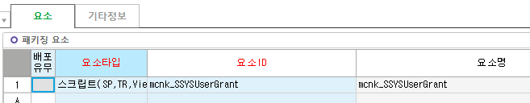
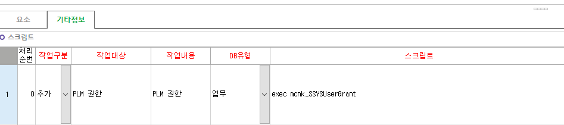

# 권한 부여

DROP PROC mcnk_SSYSUserGrant

GO

CREATE PROC mcnk_SSYSUserGrant

AS

SET NOCOUNT ON;

/\*

SELECT B.Name AS UserName, C.Name AS ObjectName, A.Permission_Name AS PermissionName,

'UNION SELECT '+

N'''' + B.Name COLLATE Korean_Wansung_CS_AS + N''' AS UserName, ' +

N'''' + C.Name COLLATE Korean_Wansung_CS_AS + N''' AS ObjectName, ' +

N'''' + A.Permission_Name COLLATE Korean_Wansung_CS_AS + N''' AS PermissionName' AS \[InsertData\],

A.state_desc COLLATE Korean_Wansung_CS_AS + ' '

\+ A.permission_name COLLATE Korean_Wansung_CS_AS + ' ON OBJECT::'

\+ C.name COLLATE Korean_Wansung_CS_AS + ' TO '

\+ B.name COLLATE Korean_Wansung_CS_AS as GRANT_SQL

FROM sys.database_permissions AS A

JOIN sys.database_principals AS B ON B.Principal_ID = A.Grantee_Principal_ID

JOIN sys.objects AS C ON C.Object_ID = A.Major_ID

WHERE A.Class = 1

AND B.Type = 'S'

AND A.state_desc = 'GRANT'

AND B.Name NOT IN ('public', 'guest')

AND B.Name = 'i2l_mes'

ORDER BY B.Name, C.Name, A.Permission_Name

\*/

DECLARE @IDX_NO INT,

@Sql NVARCHAR(1000),

@UserName NVARCHAR(100),

@ObjectName NVARCHAR(100),

@PermissionName NVARCHAR(100)

 

CREATE TABLE \#TSYSUserGrant

(

IDX_NO INT IDENTITY(1, 1),

UserName NVARCHAR(100),

ObjectName NVARCHAR(100),

PermissionName NVARCHAR(100)

)

INSERT INTO \#TSYSUserGrant(UserName, ObjectName, PermissionName)

SELECT 'plm' AS UserName, 'mcnk_TPLMBaseAlterItem' AS ObjectName, 'SELECT' AS PermissionName

UNION SELECT 'plm' AS UserName, 'mcnk_TPLMBaseAlterItem' AS ObjectName, 'UPDATE' AS PermissionName

UNION SELECT 'plm' AS UserName, 'mcnk_TPLMBaseAlterItem' AS ObjectName, 'INSERT' AS PermissionName

UNION SELECT 'plm' AS UserName, 'mcnk_VPDBaseAlterItem' AS ObjectName, 'SELECT' AS PermissionName

 

SELECT @IDX_NO = 0

WHILE 1=1

BEGIN

SELECT TOP 1

@IDX_NO = A.IDX_NO,

@UserName = '',

@ObjectName = '',

@PermissionName = ''

FROM \#TSYSUserGrant AS A

WHERE A.IDX_NO \> @IDX_NO

ORDER BY A.IDX_NO ASC

IF @@ROWCOUNT = 0 BREAK

 

SELECT @UserName = A.UserName,

@ObjectName = A.ObjectName,

@PermissionName = A.PermissionName

FROM \#TSYSUserGrant AS A

WHERE A.IDX_NO = @IDX_NO

 

IF EXISTS(SELECT TOP 1 1 FROM sys.database_principals AS B WITH(NOLOCK) WHERE B.Name = @UserName)

AND EXISTS(SELECT TOP 1 1 FROM sys.objects AS C WITH(NOLOCK) WHERE C.Name = @ObjectName)

BEGIN

IF NOT EXISTS(SELECT TOP 1 1

FROM sys.database_permissions AS A WITH(NOLOCK)

JOIN sys.database_principals AS B WITH(NOLOCK) ON B.Principal_ID = A.Grantee_Principal_ID

JOIN sys.objects AS C WITH(NOLOCK) ON C.Object_ID = A.Major_ID

WHERE A.Permission_Name = @PermissionName

AND B.Name = @UserName

AND C.Name = @ObjectName

)

BEGIN

SELECT @Sql = N'GRANT ' + @PermissionName + N' ON OBJECT::' + @ObjectName + N' TO ' + @UserName

EXEC sp_executeSql @Sql

PRINT @Sql

END

END

END

DROP TABLE \#TSYSUserGrant

 

RETURN

--GO

--EXEC mcnk_SSYSUserGrant

주석처리 된 부분으로 권한 조회 가능

 

테이블 Alter 는 상관 없지만 Drop 시 권한 지워지기 때문에 같이 넣어줘야함

 

