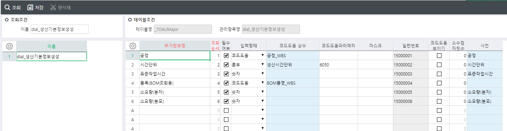

# 품목 - 생산기본정보 생성

 

CREATE PROCEDURE dial_SWDAItemInfoSave

@ServiceSeq INT = 0,

@WorkingTag NVARCHAR(10)= '',

@CompanySeq INT = 1,

@LanguageSeq INT = 1,

@UserSeq INT = 0,

@PgmSeq INT = 0,

@IsTransaction BIT = 0

AS

-------------------------

-- 생산기본정보 생성

-------------------------

-- BOM등록

-- 제품별공정별소요자재등록

-- 사업단위별생산품목정보

-- 제품별공정별워크센터등록

 

--==================================================

-- 변수선언

--==================================================

DECLARE @EnvValue NVARCHAR(100),

@IsBizUnit INT,

@Today NCHAR(8)

 

SELECT @Today = CONVERT(NCHAR(8), GETDATE(), 112)

 

--==================================================

-- LOG

--==================================================

EXEC \_SCOMXmlLog @CompanySeq ,

@UserSeq ,

'\_TPDBOMManagement' ,

'#BIZ_OUT_DataBlock1' ,

'ItemSeq' ,

@PgmSeq ,

''

EXEC \_SCOMXmlLog @CompanySeq ,

@UserSeq ,

'\_TPDBOM' ,

'#BIZ_OUT_DataBlock1' ,

'ItemSeq',

@PgmSeq ,

''

EXEC \_SCOMXmlLog @CompanySeq ,

@UserSeq ,

'\_TPDROUItemProc' ,

'#BIZ_OUT_DataBlock1' ,

'ItemSeq',

@PgmSeq ,

''

 

EXEC \_SCOMXmlLog @CompanySeq ,

@UserSeq ,

'\_TPDROUItemProcWC' ,

'#BIZ_OUT_DataBlock1' ,

'ItemSeq',

@PgmSeq ,

''

EXEC \_SCOMXmlLog @CompanySeq,

@UserSeq,

'\_TPDROUItemProcRevFactUnit',

'#BIZ_OUT_DataBlock1',

'ItemSeq',

@PgmSeq,

''

EXEC \_SCOMXmlLog @CompanySeq,

@UserSeq,

'\_TPDBOMRemarks',

'#BIZ_OUT_DataBlock1',

'ItemSeq',

@PgmSeq,

''

EXEC \_SCOMXmlLog @CompanySeq,

@UserSeq,

'\_TPDBOMProc',

'#BIZ_OUT_DataBlock1',

'ItemSeq',

@PgmSeq,

''

EXEC \_SCOMXmlLog @CompanySeq,

@UserSeq,

'\_TPDROUItemProcMat',

'#BIZ_OUT_DataBlock1',

'ItemSeq',

@PgmSeq,

''

EXEC \_SCOMXmlLog @CompanySeq,

@UserSeq,

'\_TPDROUItemProcManagement',

'#BIZ_OUT_DataBlock1',

'ItemSeq',

@PgmSeq,

''

UPDATE A

SET A.WorkingTag = 'U'

FROM \#BIZ_OUT_DataBlock1 AS A

WHERE A.WorkingTag IN (N'U')

AND A.Status = 0

AND (A.BizUnit \<\> A.BizUnitOld

OR A.WorkCenterSeq \<\> A.WorkCenterSeqOld)

 

-- 작업순서 맞추기: DELETE -\> UPDATE -\> INSERT

-- UPDATE의 경우 삭제 후 재생성

--==================================================

-- DELETE

--==================================================

/\*\*\*\*\*\*\*\*\*\*\*\*\*\*\*\*\*\*\*\*BOM 상위등록 삭제\*\*\*\*\*\*\*\*\*\*\*\*\*\*\*\*\*\*\*\*/

IF EXISTS ( SELECT TOP 1 1 FROM \#BIZ_OUT_DataBlock1 WHERE WorkingTag IN (N'U', N'D') AND Status = 0 )

BEGIN

-- BOM차수관리

DELETE \_TPDBOMManagement

FROM \_TPDBOMManagement AS A

JOIN \#BIZ_OUT_DataBlock1 AS B ON A.ItemSeq = B.ItemSeq

WHERE B.WorkingTag IN (N'U', N'D')

AND B.Status = 0

AND A.CompanySeq = @CompanySeq

 

IF @@ERROR \<\> 0 RETURN

 

-- BOM공정정보

DELETE \_TPDBOMProc

FROM \_TPDBOMProc AS A

JOIN \#BIZ_OUT_DataBlock1 AS B ON A.ItemSeq = B.ItemSeq

WHERE B.WorkingTag IN (N'U', N'D')

AND B.Status = 0

AND A.CompanySeq = @CompanySeq

 

IF @@ERROR \<\> 0 RETURN

/\*\*\*\*\*\*\*\*\*\*\*\*\*\*\*\*\*\*\*\*BOM 하위등록 삭제\*\*\*\*\*\*\*\*\*\*\*\*\*\*\*\*\*\*\*\*/

--BOM비고정보

DELETE \_TPDBOMRemarks

FROM \_TPDBOMRemarks AS A

JOIN \#BIZ_OUT_DataBlock1 AS B ON A.ItemSeq = B.ItemSeq

WHERE B.WorkingTag IN (N'U', N'D')

AND B.Status = 0

AND A.CompanySeq = @CompanySeq

 

IF @@ERROR \<\> 0 RETURN

 

--BOM 정보

DELETE \_TPDBOM

FROM \_TPDBOM AS A

JOIN \#BIZ_OUT_DataBlock1 AS B ON A.ItemSeq = B.ItemSeq

WHERE B.WorkingTag IN (N'U', N'D')

AND B.Status = 0

AND A.CompanySeq = @CompanySeq

IF @@ERROR \<\> 0 RETURN

/\*\*\*\*\*\*\*\*\*\*\*\*\*\*\*\*\*\*\*\*제품별공정별소요자재등록 삭제\*\*\*\*\*\*\*\*\*\*\*\*\*\*\*\*\*\*\*\*/

-- 삭제 순서(소요자재 --\> 공정 --\> 마스터)

-- 소요자재 삭제

DELETE \_TPDROUItemProcMat

FROM \_TPDROUItemProcMat AS A

JOIN \#BIZ_OUT_DataBlock1 AS B ON A.ItemSeq = B.ItemSeq

WHERE B.WorkingTag IN (N'U', N'D')

AND B.Status = 0

AND A.CompanySeq = @CompanySeq

 

IF @@ERROR \<\> 0 RETURN

 

-- 생산사업단위별 생산품목 삭제

DELETE \_TPDROUItemProcRevFactUnit

FROM \_TPDROUItemProcRevFactUnit AS A

JOIN \#BIZ_OUT_DataBlock1 AS B ON A.ItemSeq = B.ItemSeq

WHERE B.WorkingTag IN (N'U', N'D')

AND B.Status = 0

AND A.CompanySeq = @CompanySeq

 

IF @@ERROR \<\> 0 RETURN

 

-- 제품별공정별워크센터 삭제

DELETE \_TPDROUItemProcWC

FROM \_TPDROUItemProcWC AS A

JOIN \#BIZ_OUT_DataBlock1 AS B ON A.ItemSeq = B.ItemSeq

WHERE B.WorkingTag IN (N'U', N'D')

AND B.Status = 0

AND A.CompanySeq = @CompanySeq

 

IF @@ERROR \<\> 0 RETURN

 

-- 공정정보 삭제

DELETE \_TPDROUItemProc

FROM \_TPDROUItemProc AS A

JOIN \#BIZ_OUT_DataBlock1 AS B ON A.ItemSeq = B.ItemSeq

WHERE B.WorkingTag IN (N'U', N'D')

AND B.Status = 0

AND A.CompanySeq = @CompanySeq

 

IF @@ERROR \<\> 0 RETURN

 

-- 차수정보 삭제

DELETE \_TPDROUItemProcManagement

FROM \_TPDROUItemProcManagement AS A

JOIN \#BIZ_OUT_DataBlock1 AS B ON A.ItemSeq = B.ItemSeq

WHERE B.WorkingTag IN (N'U', N'D')

AND B.Status = 0

AND A.CompanySeq = @CompanySeq

 

IF @@ERROR \<\> 0 RETURN

END

--==================================================

-- INSERT

--==================================================

IF EXISTS ( SELECT TOP 1 1 FROM \#BIZ_OUT_DataBlock1 WHERE WorkingTag IN (N'U',N'A') AND Status = 0 )

BEGIN

/\*\*\*\*\*\*\*\*\*\*\*\*\*\*\*\*\*\*\*\*BOM 상위등록 생성\*\*\*\*\*\*\*\*\*\*\*\*\*\*\*\*\*\*\*\*/

-- BOM차수관리

INSERT INTO \_TPDBOMManagement

(

CompanySeq , ItemSeq , ItemBomRev , RegDate , LastUptDate ,

FrTermValidity , ToTermValidity , BatchSize , Remark , LastUserSeq ,

LastDateTime , FileSeq , BizUnit , RegUserSeq

)

SELECT TOP 1

@CompanySeq

, A.ItemSeq

, '00' -- 차수는 00으로 고정

, CONVERT(NCHAR(8),GETDATE(),112)

, CONVERT(NCHAR(8),GETDATE(),112)

, ''

, ''

, 0

, ''

, @UserSeq

, GETDATE()

, 0

, A.BizUnit

, @UserSeq

FROM \#BIZ_OUT_DataBlock1 AS A

WHERE A.WorkingTag IN (N'U', N'A')

AND A.Status = 0

AND NOT EXISTS (SELECT 1 FROM \_TPDBOMManagement WITH(NOLOCK)

WHERE ItemSeq = A.ItemSeq

AND CompanySeq = @CompanySeq )

IF @@ERROR \<\> 0 RETURN

-- BOM공정정보

INSERT INTO \_TPDBOMProc

(

CompanySeq , GoodSeq , GoodBomRev, ItemSeq, ItemBomRev ,

SubItemSeq , SubItemBomRev , ProcRev , ProcSeq, WorkCenterSeq,

LastUserSeq , LastDateTime , BizUnit

)

SELECT TOP 1

@CompanySeq , B.ItemSeq , '00' , B.ItemSeq , '00' , -- 차수는 00으로 고정

0 , '' , '' , 0 , B.WorkCenterSeq,

@UserSeq , GETDATE() , B.BizUnit

FROM \#BIZ_OUT_DataBlock1 AS B

JOIN \_TDAItem AS C WITH(NOLOCK) ON B.ItemSeq = C.ItemSeq

AND C.CompanySeq = @CompanySeq

WHERE B.WorkingTag IN (N'U', N'A')

AND B.Status = 0

IF @@ERROR \<\> 0 RETURN

/\*\*\*\*\*\*\*\*\*\*\*\*\*\*\*\*\*\*\*\*BOM 하위등록 생성\*\*\*\*\*\*\*\*\*\*\*\*\*\*\*\*\*\*\*\*/

--BOM 정보

INSERT INTO \_TPDBOM

(

CompanySeq , ItemSeq , ItemBomRev , Serl , UserSeq ,

SubItemSeq , SubItemBomRev , UnitSeq , SubUnitSeq , NeedQtyNumerator ,

NeedQtyDenominator , HaveChild , InLossRate , OutLossRate , ECOSeq ,

ECOItemSerl , ECOChangeSerl , ECOApplySerl , FrApplyDate , ToApplyDate ,

Location , Remark , IsCfm , LastUserSeq , LastDateTime ,

IsBOMOnly , BizUnit , IsIncludeProcMat

)

SELECT TOP 1

@CompanySeq

, A.ItemSeq

, '00' -- 차수는 '00'으로 표시합니다.

, 1 -- 품목1개만 들어가니까 Serl은 1로 표시합니다.

, @UserSeq

, C.ValueSeq --품목(BOM조회용)

, '00'

, A.UnitSeq

, A.UnitSeq

, D.ValueText -- 소요량(분자)

, E.ValueText -- 소요량(분모)

, '0'

, 0

, 0

, 0

, 0

, 0

, 0

, ''

, ''

, ''

, ''

, '0'

, @UserSeq

, GETDATE()

, 0

, ISNULL(A.BizUnit, 0)

, 0

FROM \#BIZ_OUT_DataBlock1 AS A

JOIN \_TDAUMinor AS B WITH(NOLOCK) ON @CompanySeq = B.CompanySeq

AND B.MajorSeq = 1001042 -- dial_생산기본정보생성의 TOP 1

LEFT OUTER JOIN \_TDAUMinorValue AS C WITH(NOLOCK) ON B.CompanySeq = C.CompanySeq

AND B.MinorSeq = C.MinorSeq

AND C.Serl = 15000004 -- 품목(BOM조회용)

LEFT OUTER JOIN \_TDAUMinorValue AS D WITH(NOLOCK) ON B.CompanySeq = D.CompanySeq

AND B.MinorSeq = D.MinorSeq

AND D.Serl = 15000005 -- 소요량(분자)

LEFT OUTER JOIN \_TDAUMinorValue AS E WITH(NOLOCK) ON B.CompanySeq = E.CompanySeq

AND B.MinorSeq = E.MinorSeq

AND E.Serl = 15000006 -- 소요량(분모)

WHERE A.WorkingTag IN (N'A', N'U')

AND A.Status = 0

IF @@ERROR \<\> 0 RETURN

--BOM비고정보

INSERT INTO \_TPDBOMRemarks

(

CompanySeq , ItemSeq , ItemBomRev, Serl , BizUnit ,

Remark1 , Remark2 , Remark3 , Remark4 , Remark5 ,

Remark6 , Remark7 , Remark8 , Remark9 , Remark10 ,

LastUserSeq , LastDateTime

)

SELECT TOP 1

@CompanySeq

, A.ItemSeq

, '00' -- 차수는 '00'으로 표시합니다.

, 1 -- 품목1개만 들어가니까 Serl은 1로 표시합니다.

, ISNULL(A.BizUnit, 0 )

, ''

, ''

, ''

, ''

, ''

, ''

, ''

, ''

, ''

, ''

, @UserSeq

, GETDATE()

FROM \#BIZ_OUT_DataBlock1 AS A

WHERE A.WorkingTag IN (N'U', N'A')

AND A.Status = 0

AND NOT EXISTS (SELECT 1 FROM \_TPDBOMRemarks WITH(NOLOCK)

WHERE CompanySeq = @CompanySeq

AND ItemSeq = A.ItemSeq)

IF @@ERROR \<\> 0 RETURN

/\*\*\*\*\*\*\*\*\*\*\*\*\*\*\*\*\*\*\*\*제품별공정별소요자재등록 생성\*\*\*\*\*\*\*\*\*\*\*\*\*\*\*\*\*\*\*\*/

--공정차수관리

INSERT INTO \_TPDROUItemProcManagement

( CompanySeq , ItemSeq , ProcRev , BOMRev , RegDate ,

UptDate , RegUserSeq, UptUserSeq, Remark , LastUserSeq ,

LastDateTime, BizUnit, IsMatNotSum

)

SELECT TOP 1

@CompanySeq , A.ItemSeq , '00' , '00' , @Today ,

@Today , @UserSeq , @UserSeq , '' , @UserSeq ,

GETDATE() , A.BizUnit ,0

FROM \#BIZ_OUT_DataBlock1 AS A

WHERE A.WorkingTag IN ('A', 'U')

AND A.Status = 0

AND NOT EXISTS (SELECT 1 FROM \_TPDROUItemProcManagement WITH(NOLOCK)

WHERE ItemSeq = A.ItemSeq

AND BizUnit = A.BizUnit

AND CompanySeq = @CompanySeq )

IF @@ERROR \<\> 0 RETURN

--사업단위별생산품목

INSERT INTO \_TPDROUItemProcRevFactUnit

(

CompanySeq , BizUnit , ItemSeq , Serl , BOMRev ,

ProcRev , FrDate , ToDate , LastUserSeq ,LastDateTime ,

FactUnit

)

SELECT TOP 1

@CompanySeq

, A.BizUnit

, A.ItemSeq

, 1 -- 품목1개만 들어가니까 Serl은 1로 표시합니다.

, '00'

, '00'

, @Today

, N'99991231'

, @UserSeq

, GETDATE()

, 0

FROM \#BIZ_OUT_DataBlock1 AS A

WHERE A.WorkingTag IN (N'A', N'U')

AND A.Status = 0

AND NOT EXISTS (SELECT 1 FROM \_TPDROUItemProcRevFactUnit WITH(NOLOCK)

WHERE ItemSeq = A.ItemSeq

AND BizUnit = A.BizUnit

AND CompanySeq = @CompanySeq )

IF @@ERROR \<\> 0 RETURN

--생산품목 공정 워크센터

INSERT INTO \_TPDROUItemProcWC

(

CompanySeq , BizUnit , ItemSeq , BOMRev , ProcRev ,

ProcSeq , Serl , WorkcenterSeq , IsBatch , BatchSize ,

TimeUnit , StdSetUpTime , StdWorkTime , StdReadyTime , StdMovTime,

Ranking , WorkRate , IsQC , LastUserSeq , LastDateTime,

FactUnit

)

SELECT TOP 1

@CompanySeq , A.BizUnit , A.ItemSeq , '00' , '00' ,

C.ValueSeq , 1 , A.WorkCenterSeq , '' , 0 ,

D.ValueSeq , 0 , E.ValueText , 0 , 0 ,

1 , 100 , '' , @UserSeq , GETDATE() ,

0

FROM \#BIZ_OUT_DataBlock1 AS A

JOIN \_TDAUMinor AS B WITH(NOLOCK) ON @CompanySeq = B.CompanySeq

AND B.MajorSeq = 1001042 -- dial_생산기본정보생성의 TOP 1

LEFT OUTER JOIN \_TDAUMinorValue AS C WITH(NOLOCK) ON B.CompanySeq = C.CompanySeq

AND B.MinorSeq = C.MinorSeq

AND C.Serl = 15000001 -- 공정

LEFT OUTER JOIN \_TDAUMinorValue AS D WITH(NOLOCK) ON B.CompanySeq = D.CompanySeq

AND B.MinorSeq = D.MinorSeq

AND D.Serl = 15000002 -- 시간단위

LEFT OUTER JOIN \_TDAUMinorValue AS E WITH(NOLOCK) ON B.CompanySeq = E.CompanySeq

AND B.MinorSeq = E.MinorSeq

AND E.Serl = 15000003 -- 표준작업시간

WHERE A.WorkingTag IN (N'A', N'U')

AND A.Status = 0

AND NOT EXISTS (SELECT 1 FROM \_TPDROUItemProcWC WITH(NOLOCK)

WHERE ItemSeq = A.ItemSeq

AND BizUnit = A.BizUnit

AND CompanySeq = @CompanySeq )

IF @@ERROR \<\> 0 RETURN

--생산품목공정

INSERT INTO \_TPDROUItemProc

(

CompanySeq , ItemSeq , ProcRev , Serl , ProcSeq ,

AssyItemSeq , AssyQty , ProcNo , ToProcNo , IsProcQC ,

IsLastProc , IsBNProc , OverLapRate , SMToProcMovType , IsCriticalPath,

AssyQtyNumerator, AssyQtyDenominator, MatProcSeq , LastUserSeq , LastDateTime ,

BizUnit

)

SELECT TOP 1

@CompanySeq

, A.ItemSeq -- 제품내부코드

, '00' -- 공정차수

, 1 -- 순번

, C.ValueSeq -- 공정내부코드

, A.ItemSeq -- 공정품내부코드

, 0 -- 공정품수량

, 1 -- 공정순서

, 1 -- 후속공정순서

, '0' -- 공정검사여부

, '0' -- 최종공정여부

, '0'

, 0

, 0

, ''

, D.ValueText -- 공정소요량(분자)

, E.ValueText -- 공정소요량(분모)

, 0 -- 투입공정내부코드

, @UserSeq -- 최종작업자

, GETDATE() -- 최종작업일시

, A.BizUnit -- 사업단위

FROM \#BIZ_OUT_DataBlock1 AS A

JOIN \_TDAUMinor AS B WITH(NOLOCK) ON @CompanySeq = B.CompanySeq

AND B.MajorSeq = 1001042 -- dial_생산기본정보생성의 TOP 1

LEFT OUTER JOIN \_TDAUMinorValue AS C WITH(NOLOCK) ON B.CompanySeq = C.CompanySeq

AND B.MinorSeq = C.MinorSeq

AND C.Serl = 15000001 -- 공정

LEFT OUTER JOIN \_TDAUMinorValue AS D WITH(NOLOCK) ON B.CompanySeq = D.CompanySeq

AND B.MinorSeq = D.MinorSeq

AND D.Serl = 15000005 -- 소요량(분자)

LEFT OUTER JOIN \_TDAUMinorValue AS E WITH(NOLOCK) ON B.CompanySeq = E.CompanySeq

AND B.MinorSeq = E.MinorSeq

AND E.Serl = 15000006 -- 소요량(분모)

WHERE A.WorkingTag IN (N'A', N'U')

AND A.Status = 0

IF @@ERROR \<\> 0 RETURN

--제품별 공정별 소요자재

INSERT INTO \_TPDROUItemProcMat

(

CompanySeq , ItemSeq , ProcRev , ProcSeq , Serl ,

AssyItemSeq , AssyQtyNumerator , AssyQtyDenominator, MatItemSeq , UnitSeq ,

NeedQtyNumerator, NeedQtyDenominator, SMDelvType , InLossRate , OutLossRate ,

Location , UpperItemSeq , UpperBOMRev , BOMItemSerl , ECOSeq ,

Remark , Memo1 , Memo2 , Memo3 , SubItemProcRev,

UserNo , ItemSerl , BOMRev , LastUserSeq , LastDateTime ,

BizUnit

)

SELECT TOP 1

@CompanySeq , A.ItemSeq , '00' , C.ValueSeq , 1 ,

0 , 0 , 0 , D.ValueSeq , A.UnitSeq ,

E.ValueText , F.ValueText , 6032002 , 0 , 0 ,

'' , 0 , '00' , 0 , 0 ,

'' , '' , '' , '' , '' ,

0 , 1 , '' , @UserSeq , GETDATE() ,

A.BizUnit

FROM \#BIZ_OUT_DataBlock1 AS A

JOIN \_TDAUMinor AS B WITH(NOLOCK) ON @CompanySeq = B.CompanySeq

AND B.MajorSeq = 1001042 -- dial_생산기본정보생성의 TOP 1

LEFT OUTER JOIN \_TDAUMinorValue AS C WITH(NOLOCK) ON B.CompanySeq = C.CompanySeq

AND B.MinorSeq = C.MinorSeq

AND C.Serl = 15000001 -- 공정

LEFT OUTER JOIN \_TDAUMinorValue AS D WITH(NOLOCK) ON B.CompanySeq = D.CompanySeq

AND B.MinorSeq = D.MinorSeq

AND D.Serl = 15000004 -- 품목(BOM조회용)

LEFT OUTER JOIN \_TDAUMinorValue AS E WITH(NOLOCK) ON B.CompanySeq = E.CompanySeq

AND B.MinorSeq = E.MinorSeq

AND E.Serl = 15000005 -- 소요량(분자)

LEFT OUTER JOIN \_TDAUMinorValue AS F WITH(NOLOCK) ON B.CompanySeq = F.CompanySeq

AND B.MinorSeq = F.MinorSeq

AND F.Serl = 15000006 -- 소요량(분모)

WHERE A.WorkingTag IN (N'A', N'U')

AND A.Status = 0

IF @@ERROR \<\> 0 RETURN

END

 

-- 저장 후, 저장한 Seq값을 SeqOld에 동일하게 설정해줍니다.

UPDATE A

SET BizUnitOld = A.BizUnit,

WorkCenterSeqOld = WorkCenterSeq,

ItemSeqOld = ItemSeq

FROM \#BIZ_OUT_DataBlock1 AS A

WHERE Status = 0

 

RETURN

/\*\*\*\*\*\*\*\*\*\*\*\*\*\*\*\*\*\*\*\*\*\*\*\*\*\*\*\*\*\*\*\*\*\*\*\*\*\*\*\*\*\*\*\*\*\*\*\*\*\*\*\*\*\*\*\*\*\*\*\*\*\*\*\*\*\*\*\*\*\*\*\*\*\*\*\*\*\*\*\*\*\*\*\*\*\*\*\*\*\*\*\*\*\*\*\*\*\*\*\*/