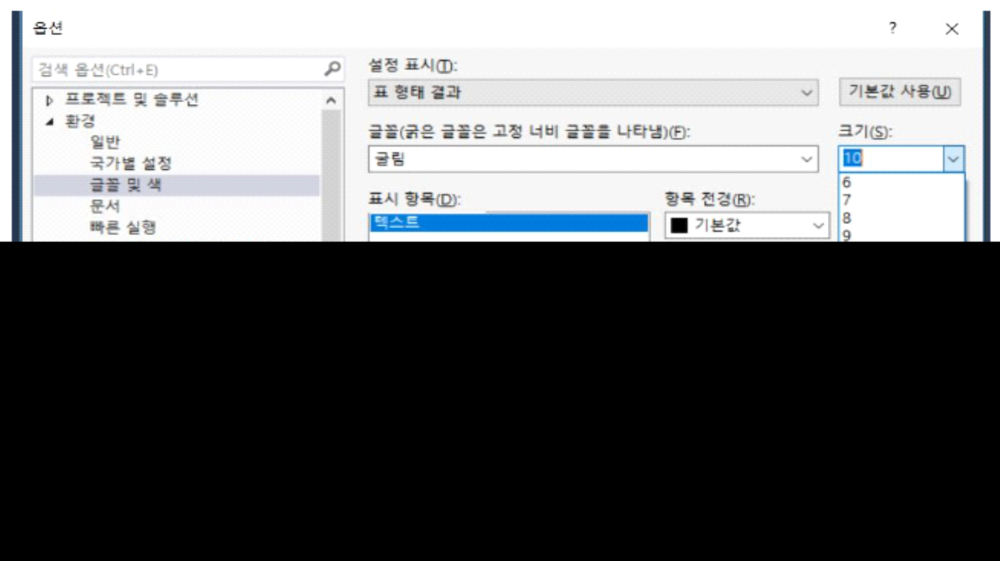

# 쿼리 결과 창 글씨 크기 변경

1.  메뉴에서 "도구 (Tools)"를 선택하고 "옵션 (Options)"을 클릭합니다.

2.  "환경 (Environment)" 카테고리에서 "글꼴 및 색 (Fonts and Colors)"를 선택합니다.

3.  설정 표시 - 표 형태 결과

4.  "글꼴 (Font)" 드롭다운 메뉴를 사용하여 원하는 글꼴을 선택하고, "크기 (Size)" 드롭다운 메뉴에서 원하는 크기를 선택합니다.

5.  변경을 적용하려면 "확인 (OK)"을 클릭합니다.

>  
>
>  
>
> 