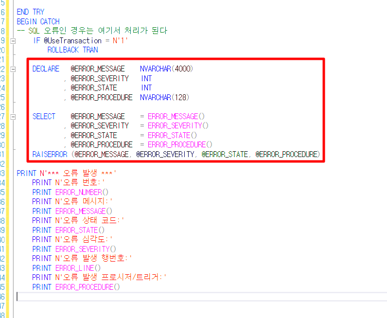

# sp 오류 확인

PRINT N'\*\*\* 오류 발생 \*\*\*'

    PRINT N'오류 번호:'

    PRINT ERROR_NUMBER()

    PRINT N'오류 메시지:'

    PRINT ERROR_MESSAGE()

    PRINT N'오류 상태 코드:'

    PRINT ERROR_STATE()

    PRINT N'오류 심각도:'

    PRINT ERROR_SEVERITY()

    PRINT N'오류 발생 행번호:'

    PRINT ERROR_LINE()

    PRINT N'오류 발생 프로시저/트리거:'

    PRINT ERROR_PROCEDURE()

 

DECLARE ~ RAISERROR 부분 대신 넣기