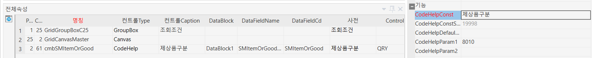

# 제상품구분 추가

cmbSMItemOrGood        CodeHelp        제상품구분        DataBlock1        SMItemOrGoodName        SMItemOrGood

 

 

 

제상품구분

19998

 

8010

 

TextBox        제상품구분        DataBlock1        SMItemOrGoodName                        DIS;        100

FloatBox        제상품구분코드        DataBlock1        SMItemOrGood                        DIS;HID;        100

 

 

 

 

 

,@SMItemOrGood INT -- 제상품구분 추가 / 시스템코드(8010)-제상품구분 25.12.17 SJPARK

 

 

,IIF(ISNULL(S1.MinorValue,0) = 1 ,'자재' ,'제상품') AS SMItemOrGoodName

,IIF(ISNULL(S1.MinorValue,0) = 1 ,8010002 ,8010001 ) AS SMItemOrGood

 

 

-- 셀바스 추가 25.12.17 SJPARK

AND ( @SMItemOrGood = 0

OR (@SMItemOrGood = 8010001 AND ISNULL(S1.MinorValue,0) \<\> 1 ) -- 제상품

OR (@SMItemOrGood = 8010002 AND ISNULL(S1.MinorValue,0) = 1 ) -- 자재

)