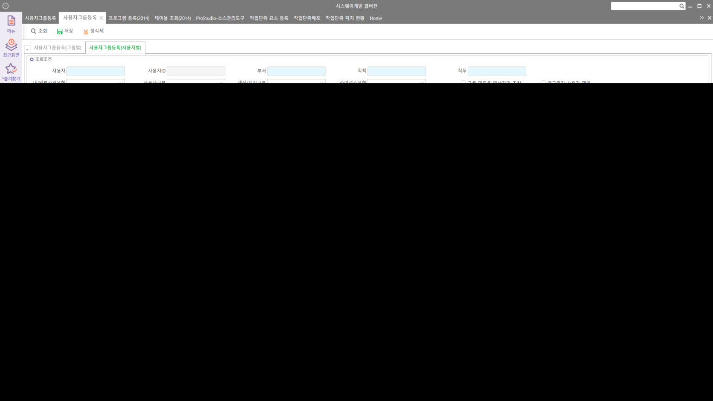

# 그룹 테이블 및 화면

FrmWCMUserGrpEntry 사용자그룹등록

 

 

SELECT \*

FROM \_TCAUserGrp AS C WITH(NOLOCK)

LEFT OUTER JOIN \_TCAUserGrpMember AS D WITH(NOLOCK) ON C.CompanySeq = D.CompanySeq AND C.GroupSeq = D.GroupSeq

LEFT OUTER JOIN \_TCAUser AS E WITH(NOLOCK) ON D.UserSeq = E.UserSeq

 

