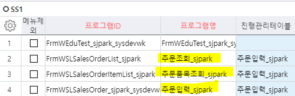
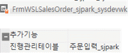
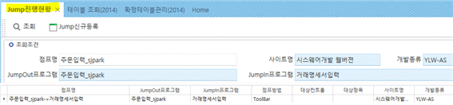

# 2/22 ACE 확정/중단/진행

- **진행관리테이블 정의 (방법 2가지)**

> **(프로그램에서 사용할 진행관리테이블 정의)**

- **1. 웹 – 프로그램 등록(2014) - ‘진행관리테이블’에 추가**

> 
>
> ** **

- **2. 개발툴**

- 프로그램 – 속성 – 추가기능 = 진행관리테이블 ==\> 주문입력_sjpark

> (주문입력, 주문조회, 주문품목조회 3개 모두 추가)
>
> (추후에 툴바는 ‘주문입력’에만 추가)
>
> 
>
> ============================================================

- **Jump진행현황** (cs - 프로그램 등록 – jump 검색 – jump진행현황 실행)

> 
>
>  
>
>  
>
>  

\<\<진행설정.hwp\>\>

 

\<\<0222.hwp\>\>