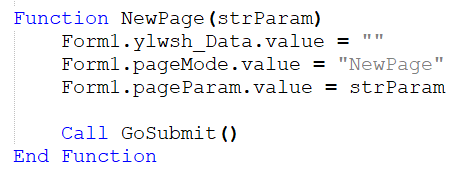
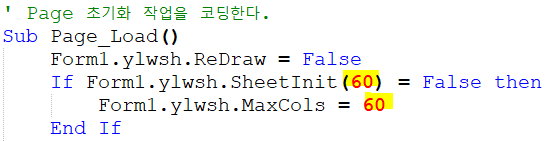
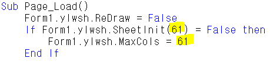
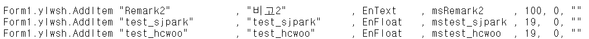
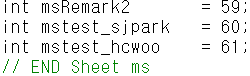
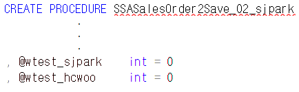
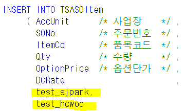
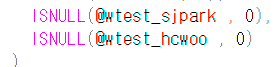

# 2/28 GNI 등록

> G&I
>
> 1\. 조회모음 (입력 등 다른거 불가능하고 조회만 가능)
>
> \- SP로만 굴러가는 화면, 현황화면
>
> (Save, Check없고 Query SP만 있음)
>
> \- ylwa 로 시작함 (ylwa00000_jsb, SCTQry_ylwa00000_jsb)
>
> ylwa + 숫자 5자리 + \_업체명
>
> ylwa 00000 \_jsb
>
> SP명 : SCTQry_ylwa00000_jsb
>
> 2\. 폼(화면)
>
> \- 확장자
>
> 1\. aspx
>
> 2\. cs
>
> 3\. resx
>
> 4\. csproj
>
> 5\. webinfo
>
> 6\. sln (자동으로 만들어짐 / 1~5는 무조건 있어야한다)
>
> \- SP
>
> (보통 aspx, cs, SP 고친다 / 나머지는 새로 개발할 때 사용)
>
> aspx - 화면, 데이터를 보여주는 쪽
>
> cs - 데이터, DB갔다오는 애
>
> \- 대부분 frm~ 으로 시작 (97%) / dlg~ (3%)
>
> \- 조회, 저장 다 가능
>
>  
>
> SA = 영업 Sales
>
> PU = 구매 Purchase
>
> PD = 생산
>
> HR = 인사
>
> COM = 공통
>
> =====================================
>
>  
>
>   
>
>  
>
>  
>
> aspx
>
> \* 처음 3줄
>
> 
>
>  
>
> \- Codebehind =\> 이름 변경
>
> \- Inherits (aspx의) 경로 =\> sjpark - Sales - ~.aspx
>
>  
>
>  
>
>  
>
> \<HTML\> 부분 (처음부터 끝까지 이긴함)
>
> 1\. 화면의 컨트롤 부분 (속성 정하기)
>
> \<변수\>값123\</변수\>
>
> +. 58번 서버에서 수정하면 더 편하다
>
>  
>
> 2\. 변수
>
> 
>
> 시트에 필요한 변수 작성 (EX. No, 판매구분 등등)
>
> (마스터 부분은 id가 있기 때문에 변수 설정이 필요 없다)
>
> 양식 : ms~
>
> 고객사 : 컬럼 추가해주세요~
>
> =\> ms~ 추가
>
>  
>
> 3\. Function (함수) (Ace의 툴바)
>
> 
>
> aspx =\> 화면에 보여주는 부분이므로 =\> JumpOut
>
> 화면에 있는 데이터를 긁어가서 점프하기 때문에
>
> cs =\> JumpIn 다른 화면이 준 데이터를 보여줌
>
>  
>
>  
>
>  
>
>  
>
> 4\. Page_Load() (제일 중요 / 거의 이거만 고침)
>
> 
>
>  
>
> 순서가 중요 =\> 60 =\> 전체 컬럼 갯수
>
>  
>
> G&I 의 가장 큰 특징 중 하나가 특징대로 출력한다는 점이다
>
> Ace에서는 컬럼 추가 시 위치는 별도로 지정 안해도 되지만
>
> G&I는 순서가 정해져 있기 때문에 중간에 추가하면
>
> 다시 일일히 뒤로 내려야한다
>
>  
>
> 5\. 코드도움 함수 (Sub txt\~\~~\_CodeHelp(IsDblClick)
>
> 코드도움 추가하려면 이걸 하나 추가하면 된다
>
>  
>
> 6\. Private Sub ylwsh_Change(Col, Row)
>
> ====
>
> 영림원 시트
>
> 사용자가 시트를 바꿀 때
>
> ex. 수량, 판매단가 쓰면 자동으로 판매금액 나오는 것
>
> ============================
>
>  
>
>  
>
>  
>
>  
>
>  
>
> Ksystem.NET - bin -
>
> cs는 dll파일로 되어있다 (
>
>  
>
> (
>
> 61.250.183.58 - 회사 서버 (yjkwon / 1003)
>
> 너무 옛날 버전이라, 윈도우 8이후부터는 개발이 안됨
>
> 그래서 xp인 회사 서버를 사용
>
> aspx를 보려면 csproj를 봐야함
>
> Ctrl Shift B =\> 컴파일
>
> (aspx, cs에서 수정했던 부분이 들어가있는 bin폴더를 자동으로 만들어 생성
>
> =\> dll파일)
>
> 단순 화면, 디자인 수정은 dll파일 생성 안됨)
>
>  
>
> 새로운 dll파일을 복붙하면 서버에 옮기는데 시간이 걸려서 컴퓨터 모두 렉걸려서
>
> 보통 점심시간, 18시이후에 올린다
>
> )
>
> 58번 서버에서 수정 후 컴파일 =\> 생성된 dll파일을 1번서버 (Ksystem.NET–bin에 붙여넣기)
>
>  
>
>  
>
>  
>
>  
>
>  
>
>  
>
>  
>
>  
>
>  
>
>  
>
>  
>
>  
>
>  
>
>  
>
>  
>
>  
>
>  
>
>  
>
>  
>
>  
>
>  
>
>  
>
>  
>
>  
>
>  
>
> \* cs
>
> aspx 수정 및 저장 후 F7을 누르면 cs에서도 자동으로 생성
>
> 저장도 순서대로 저장해야함
>
> SP도 저장순서 동일
>
> (순서로 취급하기 때문에 이름이 달라도 상관없다)
>
>  
>
> SetToolBar
>
> 0 - 사용안함 =\> 아이콘이 회색되면서 클릭 불가
>
> 1 - 사용
>
>  
>
> SetComboAndVar
>
> 콤보값 넣어주기
>
>  
>
> TDAMajor =\> 앞에 \_안붙음
>
>  
>
> SetDefault()
>
> \- ex. YMD
>
>  
>
>  
>
> ===========

- SP

> Ctrl + H =\> Site_Init =\> sjpark 이름 변경하고 끝
>
> ======================================
>
> 61.250.183.58 - 옵션표시
>
> 로컬리소스 - 자세히 - 새볼륨 d 체크 - 확인 - 연결
>
> ybheo
>
> 0930
>
>  
>
> 2개열기
>
> 탐색기 - 기타:d - ksystem \~\~~ : sjpark을
>
> 이 컴퓨터의 d드라이브 ksystem.net에 복붙
>
> =\> 끝까지 들어간 후
>
> csproj파일 열기
>
> 오른쪽 aspx 파일 열기 =\> 수정 시작
>
> ctrl shift b =\> 컴파일 =\> bin폴더 생성 =\> 본인 d에 bin 폴더 옮기기
>
> 원격 내리고 옮긴 bin확인 - 수정한 날짜 확인해보면 혼자 최신임
>
> ==============================================
>
> 61.250.183.1
>
>  
>
>  
>
> 빨간색 위 화살표 - 폼등록
>
>  
>
> 저장 후
>
> 영업/수출관리 - 영업활동 - 수주현황 에서 보인다
>
>  
>
> 뒤에 \*이 붙음 =\> 개발된 화면 =\> 수주입력\* (수주입력\*\* =\> 버전2)
>
> 없으면 표준화면 =\> 수주입력
>
>  
>
> 수주현황에서 더블클릭 =\> 점프되어서 수주입력으로 간다
>
>  
>
> 개발된 곳으로 점프 하게 하려면
>
> 마스타 및 운영관리 / 운영관리 / 프로그램 / Jump항목 등록
>
> =\> 추가개발 =\>
>
>  
>
>  
>
> 저장 sp =\> ace는 1번 돌지만 G&I는 행 갯수만큼 돈다
>
> =\> 오류발생 시 오류 직전까지는 넣도록 할 수 있다
>
>  
>
> 삭제 =\> 키 값만 넣어서 삭제
>
> 1번서버
>
> sysdelv1!@
>
>  
>
> 58번서버
>
> yjkwon - 1003
>
>  
>
>  
>
> TSASOItem - 컬럼 (시트정보) 들이 들어가 있다
>
>  
>
> 본인화면에 test_sjpark 컬럼추가
>
> 1\. ASPX에서 컬럼추가 ==\> ksystem.net/sjpark/Sales/SASalesOrder_02_sjpark/ ~ 에 추가
>
> Private 에서 변수 선언
>
> 쭉 내려와서
>
> Page_Load 부분에 추가 (맨 마지막에 추가) (맨위에 전체갯수 59 =\> 60)
>
> 19,0,""
>
>  
>
> 2\. CS에서 저장하는 부분에 추가 =\> ksystem.net/bin
>
> ==========
>
> SaveSheetValue 끝에 추가
>
> 다 하고 =\> 컴파일 컨트롤 쉬프트 B =\> dll, aspx 옮기기
>
> 3\. SP에서 조회, 저장 잘 고치기
>
>  
>
> 58번 - 컴파일해서 dll / 컨트롤영역 쉽게 보기

- 과제

<!-- -->

- 시트에 컬럼 추가하기

 

aspx

1.  변수 추가

> 

 

2.  전체 갯수 1 증가

> 

 

3.  시트에 추가

> 

 

cs

1.  body 부분 수정 (58번 서버에서 수정 시 body부분 눌러서 열어야 검색해서 찾을 수 있다)

 

aspx =\> 1번 서버로 옮기기 =\> 화면에 나온다

 

 

 

 

 

 

 

 

저장 및 조회하기 위해 SP 수정

 

1.  SSASalesOrder2Save_02_sjpark

> 
>
>  
>
>  
>
> 
>
>  
>
> 
>
> 
>
>  
>
>  
>
>  
>
>  
>
> 
>
> --------------------------------------------------------------------------------

2.  SSASalesOrder2Qry_sjpark

> 
>
>  
>
> 
>
>  

\<\<SASalesOrder_02_Site_Init.zip\>\>\<\<0228_GNI등록.hwp\>\>

 

\<\<0228_GNI등록.hwp\>\>