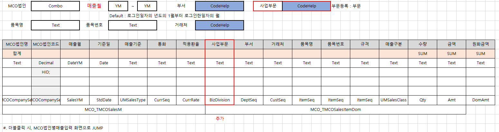
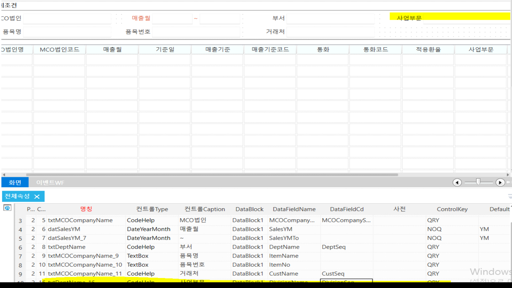
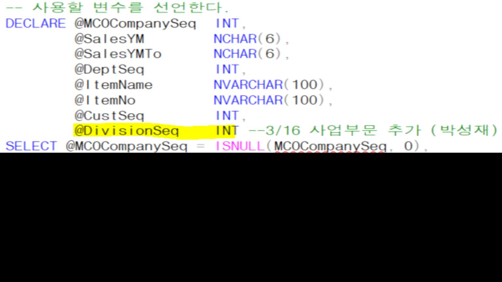
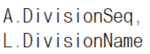
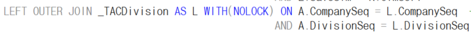
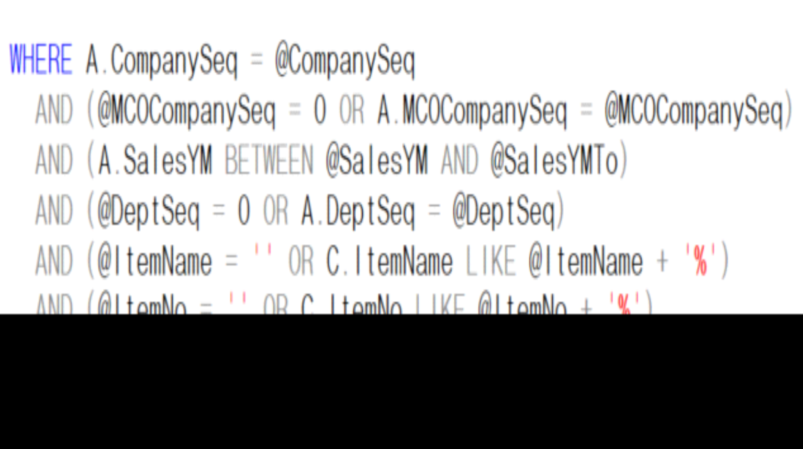

# 3/16 - 1. 컬럼, 시트 추가

| 수정 | MCO법인별매출조회 | FrmWMCOSalesItemDomList_mcnk | mcnk_SWMCOSalesItemDomListQuery |
|----|----|----|----|

 

 

 

 

SP 수정 (마스터, 아이템 UNION 으로 같이 되어있으므로 1개의 SP에서 둘다 수정

1.  선언

 

 

2.  SELECT (JOIN)

 

> 
>
> 
>
>  

3.  WHERE 조건

>