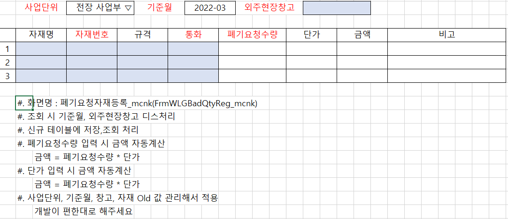
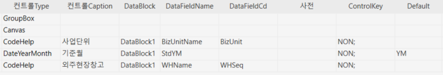
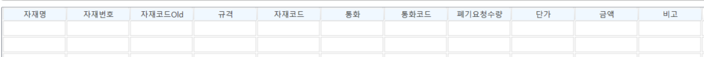
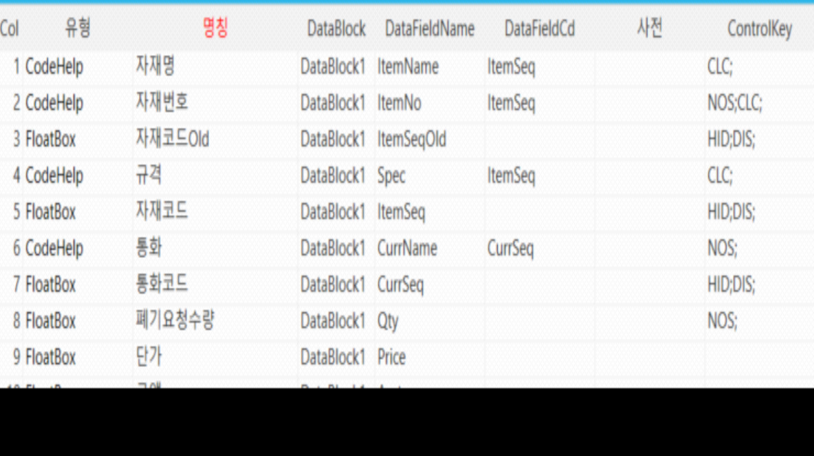
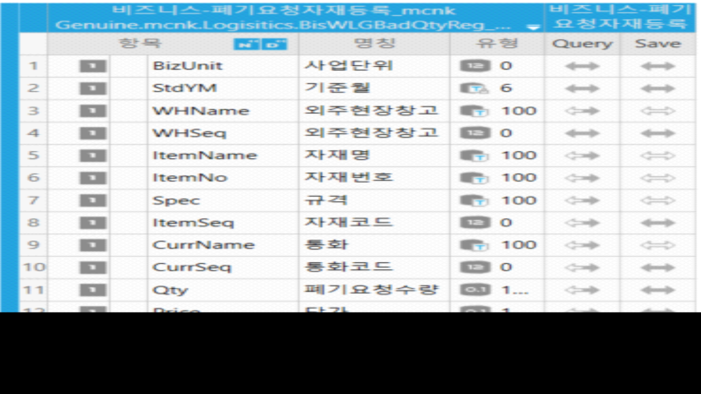
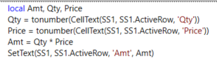

# 3/16 - 2-1.신규

| 신규 | 폐기요청자재등록_mcnk 개발 | FrmWLGBadQtyReg_mcnk |
|------|----------------------------|----------------------|

 

 

 

| 사업단위     | 사업단위_WBS  |
|--------------|---------------|
| 외주현장창고 | 창고_WBS      |
| 자재명       | 자재 품명_WBS |
| 자재번호     | 자재 품번_WBS |
| 규격         | 자재 규격_WBS |
| 통화         | 통화_WBS      |

 

외주현장창고 - 창고_WBS

자재

 

 

 

 

2.  이벤트 메소드 (수량 \* 단가 = 판매금액)

> local Amt, Qty, Price
>
> Qty = tonumber(CellText(SS1, SS1.ActiveRow, 'Qty'))
>
> Price = tonumber(CellText(SS1, SS1.ActiveRow, 'Price'))
>
> Amt = Qty \* Price
>
> SetText(SS1, SS1.ActiveRow, 'Amt', Amt)        
>
>  
>
> 
>
>