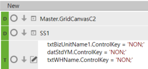
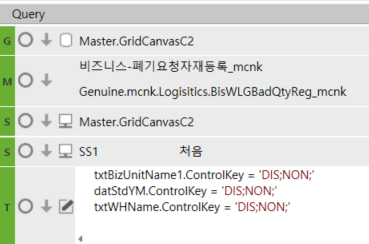
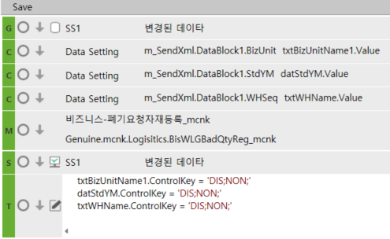
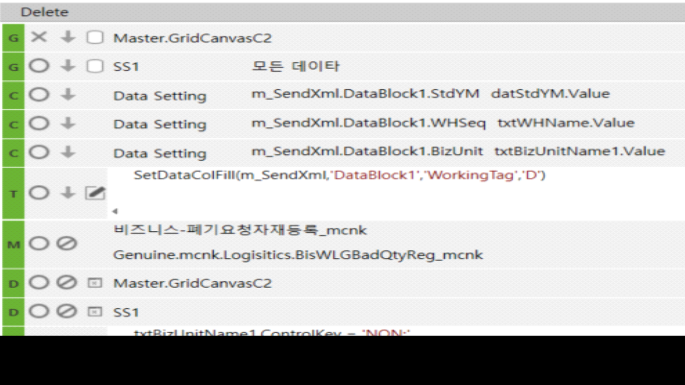
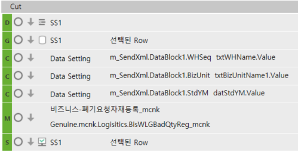

# 3/16 - 2-2.툴바

\*\* 조회 시 컬럼 DIS처리 =\> 신규일 때는 DIS 없어져야함

 

- 신규

> txtBizUnitName1.ControlKey = 'NON;'
>
> datStdYM.ControlKey = 'NON;'
>
> txtWHName.ControlKey = 'NON;'
>
> 
>
>  

- 조회

> 
>
>  
>
> (조회 시 컬럼 DIS처리)
>
> txtBizUnitName1.ControlKey = 'DIS;NON;'
>
> datStdYM.ControlKey = 'DIS;NON;'
>
> txtWHName.ControlKey = 'DIS;NON;'
>
>  

- 저장

> 
>
>  
>
> 마스터, 아이템 영역 모두 같은 테이블에 있기 때문에 마스터영역을 따로 Get 할 필요는 없다
>
> 다만, 이 경우 마스터 영역 3개가 null값으로 들어오기 때문에
>
> Change를 사용하여 별도로 값을 넣어준다
>
>  

- 삭제

> 
>
>  

- 행 삭제

> 
>
>