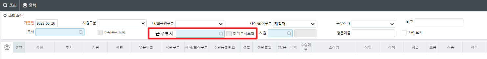

# 5/26 사원명부조회_cns

1)  "인원현황예외자등록"에 포함된 인원은 제외 요청 (화면:인원현황예외자등록)

2\) 병역 사항 (입대일 / 전역일) 추가

3\) 조회조건 근무부서 추가 및 위치 변경 (탭순서 오른쪽 상단에서 왼쪽 하단으로 맞춤) -이미지

4\) 조직명(근무) 컬럼 추가

 

근무부서 코드도움

 

 

조회조건

근무부서        DataBlock1        WkDeptName        WkDeptSeq

CheckBox        하위부서포함        DataBlock1        IsLowWkDept

 

 

 

 

시트

조직명         DataBlock3        DeptFullName

조직명(근무)        DataBlock3        WkDeptFullName

 

입대일        DataBlock3        MilEnrolDate

전역일        DataBlock3        MilTransDate