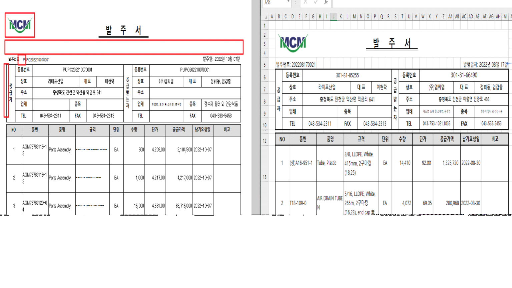
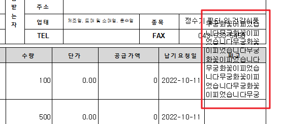

# 

 

1\. 세로양식으로 개발해주세요.

2\. 폰트 확인 요청: 폰트 크기가 타이틀이 더 작아보입니다. 전체 맑은고딕으로 적용바라며, 크기 일정한지 확인 바랍니다.

3\. 규격도 칸을 넘어가면줄바꿈이 적용해주세요.

   - 높이 자동 조절하지 않고 기본 칸 높이를 크게 만든것 같은데 일반적인 사이즈로 나오게 해주세요. 한줄만 있어도 너무 크게 나옵니다.

     

0.125, 1 1 1, 0.125, 0.125

4\. 선 두께, 이중선 적용 바랍니다.

5\. 발주번호에 : 없습니다.

6\. 발주서 타이틀과 하단 내용사이 간격이 너무 넓습니다. 절반정도로 줄여주세요.

7\. 로고 크기 좀더 키워주세요.

8\. 세로 형식으로 변경 하므로 시트의 No칸을 좀더 작게 변경 해주시길 바랍니다.

 

 

 

출처: \<<http://61.250.183.6:8100/Page/Open/24042/100101/0/18820244>\>