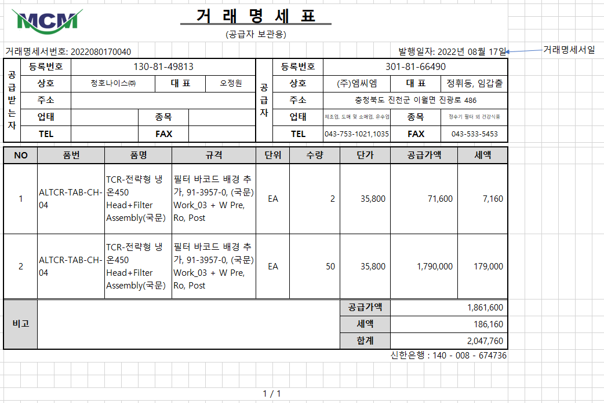
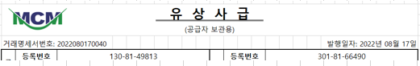

# 

 

\* 마이크로필터의 거래명세서 양식과 유사하므로 수정 적용해주세요.

 

1\. 거래명세서입력, 거래명세서조회에서 출력. (표준 SP 내용 활용)

2. 품번, 품명, 규격은 거래처품목명칭과 상관없이 품목마스터의 품번, 품명, 규격 조회

3\. 하단의 은행, 계좌정보는 고정

4\. 비고는 거래명세서의 마스터 비고 조회

5\. 빈칸그리기 옵션 없음

6\. 품번, 품명, 규격이 셀을 넘어가는 경우 글자크기 조정 없이 줄바꿈, 칸 늘어나도록 적용

7\. 하단에 페이지번호 추가

  1) 현재페이지 / 전체페이지

8. 출고구분의 추가정보 값이 "유상사급"에 체크되어 있으면 타이틀을 거래명세서에서 "유  상  사  급"으로 변경

   

 

 

 

출처: \<<http://61.250.183.6:8100/Page/Open/24203/100101/0/18820244>\>