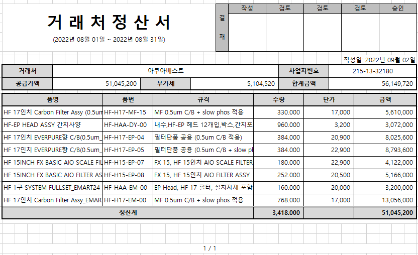

# 거래처정산서 출력물

> 
>
>  

1\. 거래명세서 품목조회에서 출력                

        - 선택된 내역만 출력하며, 거래처별로 페이지 넘김처리        

2\. 항목설명                

        1) 타이틀: 거래처정산서 명칭 하단에 조회조건의 거래명세서일From ~ 거래명세서일To 조회)        

                ex\> 2022-08-01~2022-08-31 조회시 "(2022년 08월 01일 ~ 2022년 08월 31일)"

        2) 공급가액, 부가세: 선택된 거래명세서품목건의 판매금액, 부가세액 합계        

        3) 합계금액: 공급가액 + 부가세        

        4) 품명~금액은 거래명세서의 품목정보, 수량, 판매금액 조회        

        5) 작성일: 출력일자 조회        

3\. 하단에 페이지번호 추가                

  1) 현재페이지 / 전체페이지                

 

 

출처: \<<http://61.250.183.6:8100/Page/Open/24273/100101/0/18820244>\>