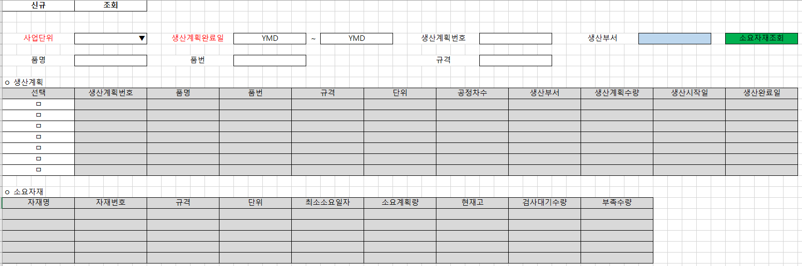

# 

 

1\. 생산계획별소요자재조회 화면 수정 개발                

2\. 상단시트(생산계획)                

        1) 자재소요생성여부, 대표구매요청번호 삭제        (IsMRPReg, POReqNo 삭제)

 

 

3\. 하단시트(소요자재)                

        1) 안전재고, 출고예정량, 입고예정량, 구매요청수량 컬럼 삭제        (SafeQty, OutExpQty, InExpQty, POReqQty)

 

 

 

        2) 컬럼추가        

                - 검사대기수량 : 구매납품, 외주납품, 생산실적건 중 검사구분이 미검사인 수량 조회 (현재일로부터 3개월전 구매납품, 외주납품, 생산실적 건부터 조회)

                - 부족수량 : 소요계획량 - (현재고+검사대기수량)

 

 

출처: \<<http://61.250.183.6:8100/Page/Open/24428/100101/0/18820244>\>