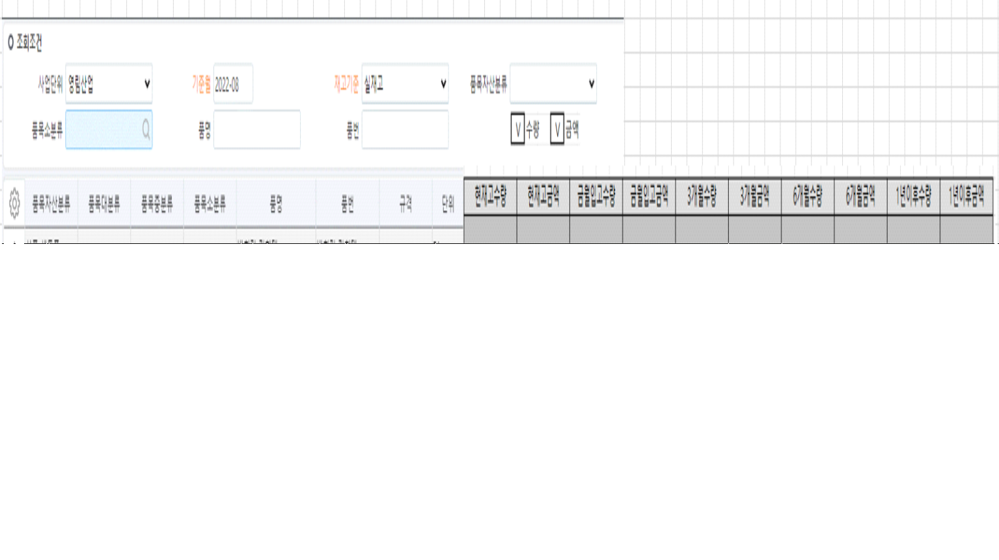

# 1개월수량 3개월수량 6개월수량 1년이후수량

 

1\. 재고Aging 조회 화면 수정개발                        

2\. 조회조건 추가                        

        - 수량, 금액: 체크박스(Default: 체크)                

3\. 시트 컬럼 수정                        

        1) 1개월수량~3년이후 수량을 3개월수량, 6개월수량, 1년이후수량으로 변경                

                - 3개월수량: 기존 컬럼기준 1개월수량~3개월수량        

                - 6개월수량: 기존 컬럼기준 6개월수량~9개월수량        

                - 1년이후수량: 기존 컬럼 기준 1년수량~3년이후수량        

        2) 현재고금액, 금월입고금액, 3개월수량금액, 6개월수량금액, 1년이후수량금액 추가                

                - 각각 수량컬럼 뒤에 추가        

                        ex) 현재고수량/현재고금액/금월입고수량/금월입고금액 …....

                - 금액: 수량\*표준재고단가        

                        -\> 표준재고단가등록(통합)에 입력된 표준재고단가

4\. 조회                        

        1) 수량, 금액 체크 여부에 따라 수량컬럼, 금액컬럼 조회. 언체크시 숨김처리(월품목구매현황 화면 참고)                

                - 수량컬럼: 현재고수량, 금월입고수량, 3개월수량, 6개월수량, 1년이후수량        

                - 금액컬럼: 현재고금액, 금월입고금액, 3개월금액, 6개월금액, 1년이후금액        

 

 

출처: \<<http://61.250.183.6:8100/Page/Open/24519/100101/0/18820244>\>