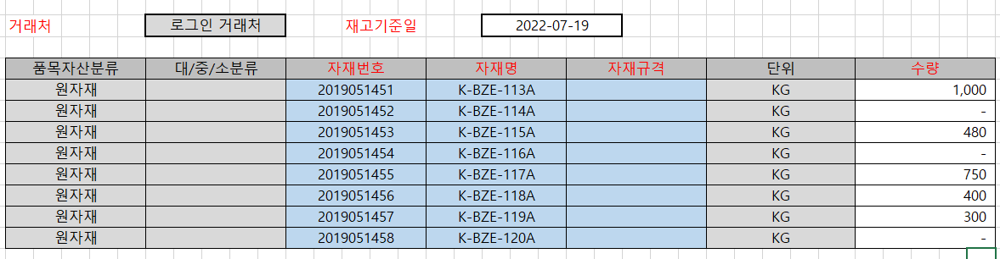

# 외주처 재고등록

\- 개요                                                                                                        

> \- 유상사급자재에 대한 협력사 재고보유 현황을 파악하기 위한 화면입니다.                                        
>
> \- 협력사에서 최신일자 기준의 재고수량을 업데이트 합니다.                                                        

\- 상세                                                                                                        

> \- 외부사용자의 소속 거래처를 거래처 조회조건에 자동입력 합니다.                                                 
>
> \- 거래처에 해당하는 재고기준일과 자재별 수량을 조회합니다. 입력된 데이터가 없는 경우 현재일자를 디폴트로 설정합니다.                                                                                                
>
> \- 사용자는 재고기준일을 최신일자로 변경하고 자재별 재고수량을 등록 및 업데이트 합니다. 거래처별 자재를 중복하여 등록할 수 없습니다.