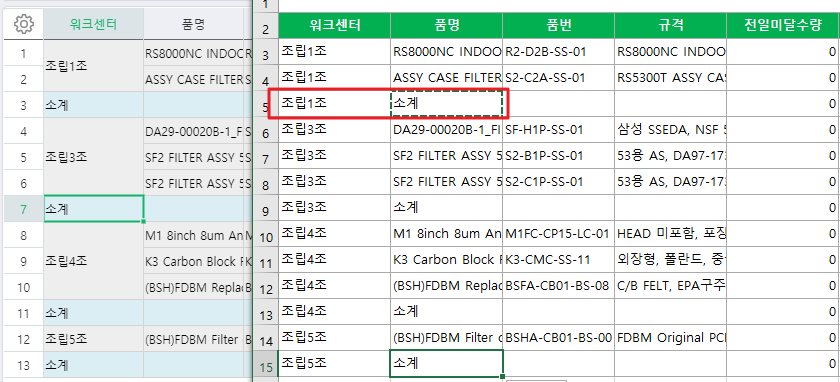
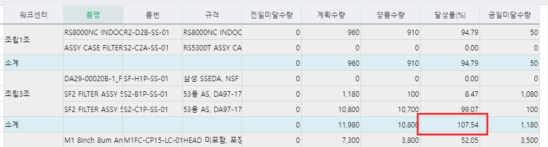

# 

1\. 전일미달, 생산계획 수량 집계 수정

   1) 중단건의 잔량 제외 요청

       - ex) 작업지시: 100, 생산실적: 80 입력해서 20개 잔량으로 남은건 중단시 잔량만 제외한 80으로 집계 되어야 함

   2) 외주워크센터건 제외

> JOIN \_TPDBaseWorkCenter AS W WITH(NOLOCK) ON A.WorkCenterSeq = W.WorkCenterSeq
>
> AND A.CompanySeq = W.CompanySeq
>
> WHERE (W.SMWorkCenterType IN (6011001, 6011002)) -- 외주워크센터건 제외

 

 

2\. 달성률 수식 수정요청합니다.

   - 양품수량/(전일미달수량+계획수량)으로 변경바랍니다.

3\. 소계절 수정요청

   1) 정렬시 소계절 구분이 안되므로 워크센터 조회하고, 품명에 "소계" 조회하도록 수정요청합니다.

   2) 소계절의 달성률 계산시 합산이 아닌 소계절의 양품수량/(전일미달수량+계획수량)으로 계산되어야 합니다.

 

 

출처: \<<http://61.250.183.6:8100/Page/Open/25164/100101/0/18820244>\>