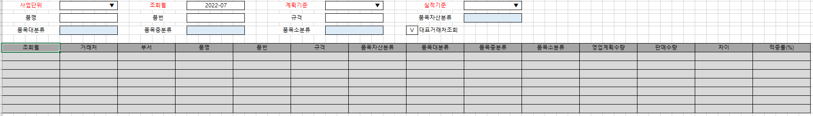

# 영업계획대비판매적중률조회_mcf

1\. G&I 개발화면으로 품목별판매계획에 입력된 품목 계획수량 대비 월 실제판매 수량을 비교하는 화면 입니다.                                        

2\. 조회조건 설명                                        

        1) 계획기준: 연간계획/월실행계획 ( 품목별 판매계획의 계획기준 콤보 참고)                                

        2) 실적기준: 거래명세서/세금계산서 ( 거래처미수분석의 실적기준 콤보 참고)                                

        3) 대표거래처조회: 체크시 영업업무별처리거래처등록의 대표거래처로 집계해서 조회                                

3\. 조회                                        

        1) 품목별 판매계획, 실적기준의 판매수량을 집계해서 조회(Full Outer 형식으로 둘중 하나라도 존재하면  조회 함)                                

        2) 실적 집계시 유상사급여부 체크된 항목 제회                                

4\. 항목설명                                        

        1) 영업계획수량: 품목별 판매계획의 계획수량 집계                                

        2) 판매수량: 조회조건 실적기준에 해당하는 판매수량 집계                                

        3) 차이 : 영업계획수량 - 판매수량                                

        4) 적중률(%): 아래 Case문 적용. G&I 수정사항                                

                case when isnull(영업계획수량,0) \> isnull(판매수량,0)                           

                       then (case when isnull(영업계획수량,0) \<\> 0 then (isnull(판매수량,0) / isnull(영업계획수량,0)) \* 100 else 0 end)                          

                       when isnull(영업계획수량,0) \< isnull(판매수량,0)                           

                       then (case when isnull(판매수량,0) \<\> 0 then (isnull(영업계획수량,0) / isnull(판매수량,0)) \* 100 else 0 end)                          

                       when isnull(영업계획수량,0) = isnull(판매수량,0)                           

                       then (case when isnull(영업계획수량,0) \<\> 0 and isnull(판매수량,0) \<\> 0 then (isnull(영업계획수량,0) / isnull(판매수량,0)) \* 100 else 0 end)                          

                       else 0 end                        

 

 

출처: \<<http://61.250.183.6:8100/Page/Open/25327/100101/0/18820244>\>