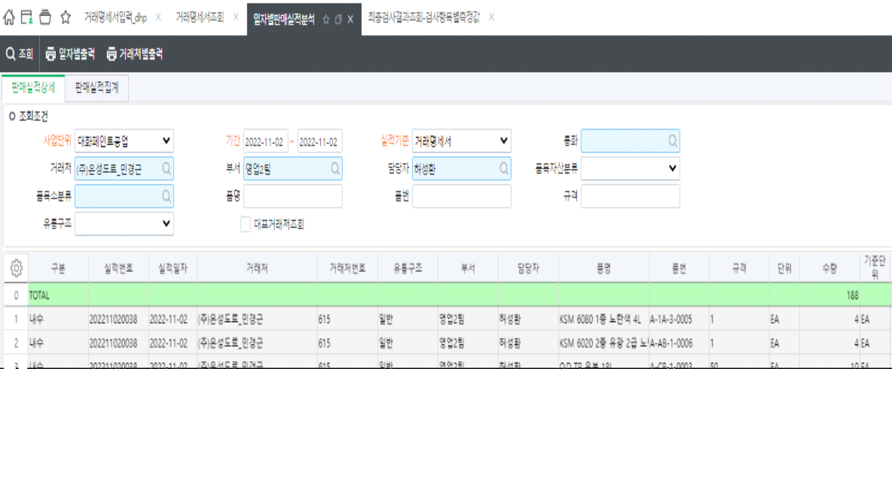
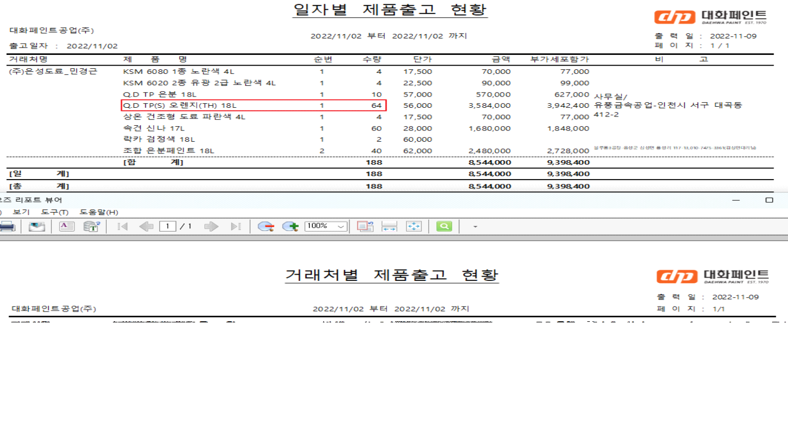

# 

\- 거래명세서에 동일한 품목이 있을 경우, 일자별판매실적분석 화면에서는 품목별로 합산하여 조회되고 있습니다. 

 

\- 출력물에도 합산된 내역이 조회되고 있는데 건별로 조회되도록 수정해주세요. 두 양식의 품목 조회순서도 거래명세서 순서에 맞게 통일시켜 주세요.

\- 단가도 평균단가로 조회되고 있는데 개별 판매단가가 조회되어야 합니다.

 

출처: \<<http://61.250.183.6:8100/Page/Open/26774/100101/0/18820244>\>