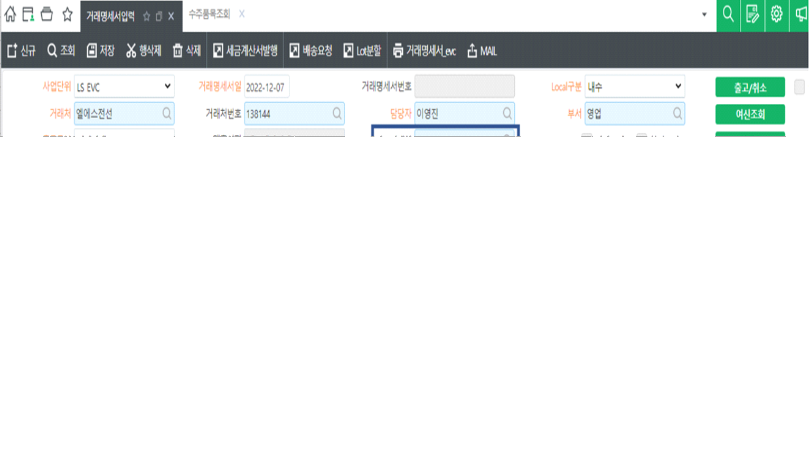

# 

1\. 행추가 기능 추가

  1) \[행추가\] 버튼 앞에 숫자입력칸은 디폴트로 '1'을 입력

  2) \[행추가\] 버튼을 클릭하면 포커스 있는 행을 그대로 복사

  3) 복사하여 행추가 시 \[행추가\] 버튼 앞에 숫자입력칸에 있는 숫자만큼 행추가

  4) \[행추가\] 버튼 뒤에 위치한 숫자칸에는 시트행 수 표시

  5) \[행추가\] 버튼 뒤에 위치한 숫자칸은 Dis

  6) 행추가 시 몇개가 추가 되었는지 몰라서 표시하는 것임 ('A'로 표시 되므로)

2\. 위탁구분 \<--\> 납품거래처 서로 위치 바꾸기

3\. LotNo 코드도움 시 재고수량을 수량에 입력 (LotNo를 붙여넣기 해도 동일하게 수량에 재고수량 입력)

 

출처: \<<http://61.250.183.6:8100/Page/Open/27900/100101/0/18820244>\>

 

--==============================================================

-- 행추가 - 입력한 숫자만큼 행추가하기 (거래명세서입력_evc, 구매납품입력_sscnt)

--==============================================================

-- 버튼은 행추가지만 기능은 행복사에 가까움....

local IsSet, IsNotAllModify, IsNotRowAdd, IsNotAccAmtMod, col, CellName, CellNameText, RowAddCnt

 

RowAddCnt = fltRowCnt.Value

 

if tonumber(RowAddCnt) == 0 then

> RowAddCnt = 1

end

 

-- 데이터복사

ActiveRowOld = SS1.ActiveRow

 

for row = 0, RowAddCnt -1 do

> Trow = SS1.DataRowCnt

 

> -- 행추가
>
> SS1.StartRow = Trow
>
> SS1.ActionCount = 1
>
> SS1.ActionType = 'ActionType_InsertRow'

 

> -- 컬럼을 돌면서 데이터 복사하여 넣자
>
> for col = 0, SS1.MaxCols - 1 do
>
> SS1.ActiveCol = col
>
> CellName = SS1.ActiveColumnName

 

> CellNameText = CellText(SS1, SS1.ActiveRow, CellName)

 

> if SS1.ActiveColumnName == 'InvoiceSerl' then
>
> CellNameText = ''        
>
> end

 

> SetText(SS1, Trow, CellName, CellNameText)
>
>  
>
> if SS1.ActiveCellReadOnly == true then
>
> SS1.ActiveRow = Trow
>
> SS1.ActiveCellReadOnly = true
>
> SS1.ActiveRow = ActiveRowOld
>
> end
>
> end

 

> -- 추가된 행은 워킹태그를 'A'로 변경하자.
>
> SS1.ActiveRow = Trow
>
> SS1.WorkingTag = 'A'

end