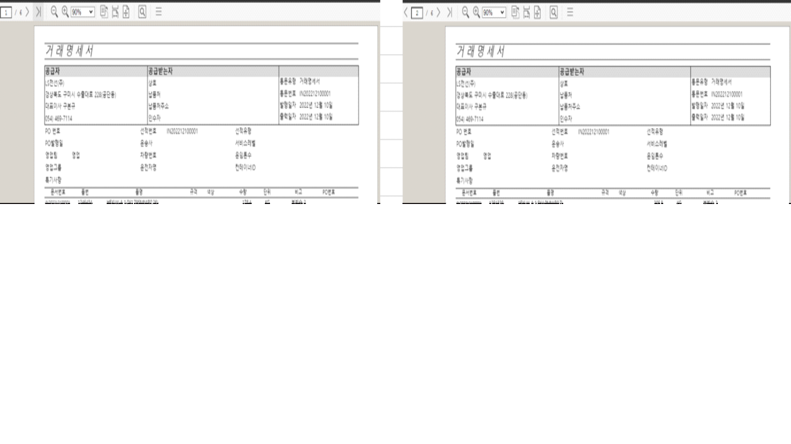

# 

\[거래명세서 오류내용\]

1\. 품목을 2가지 이상 입력한 경우 거래명세서 출력물에서 품목별로 페이지 스킵이 발생함

   위의 거래명세서는 3장만 출력되면 되는데 품목이 2개여서 2x3으로 6장이 출력됨

 

\[추가수정내용\]

1.배차등록항목 적용

 1) 차량번호 : 차량번호가 있으면 차량번호 출력, 없으면 차량번호(수기)를 출력

 2) 서비스레벨 : '일반'으로 하드코딩

 3) 컨테이너ID : 공란

 4) 나머지 항목 : 배차등록 시 입력한 항목들 출력

   - 운송사, 운전자명, 선적유형, 운임톤수

 

출처: \<<http://61.250.183.6:8100/Page/Open/28139/100101/0/18820244>\>