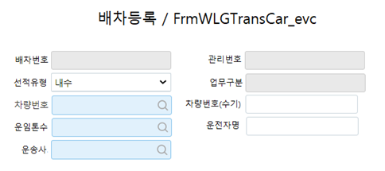
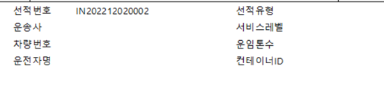
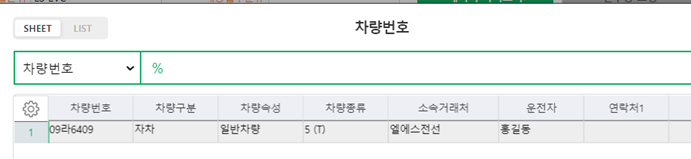
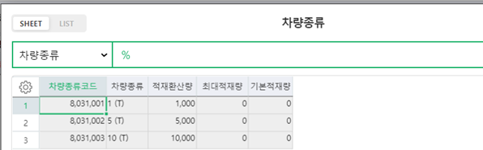

# 

배차등록 화면 신규개발

1\. 거래명세서입력, 기타출고입력, 자재기타출고입력, 이동입력 등의 화면에 점프로 입력함

2\. 이번 개발은 거래명세서에서 입력하는 것까지임

3\. 각 항목별 정의

  1) 배차번호 : 저장후 자동생성 - 년/월/일(8자리) + 일련번호(4자리)

  2) 관리번호 : 업무구분의 번호 (거래명세서번호, 기타출고번호 등)

  3) 업무구분 : 거래명세서 / 기타출고 / 자재기타출고 / 이동 등

  4) 선적유형 : Local 구분, 기타출고처럼 Local구분이 없는 경우 디폴트로 '내수' 지정

  5) 차량번호 : 차량번호, 차량번호 코드도움

    - 차량번호 입력 시 운임톤수(차량종류), 운전자명 자동입력

  6) 차량번호(수기) : 차량이 미등록된 차량으로 운행 시 수기로 직접입력하는 항목

  7) 운임톤수 : 차량종류, 차량종류 코드도움

    - 차량번호 입력 시 자동입력, 수정가능

  8) 운전자명 : 미등록 차량인 경우 텍스트로 수기 입력

    - 차량번호 입력 시 자동입력, 수정가능

  9) 운송사 : LS EVC 환경설정에 배차 운송업체에 입력된 거래처를 디폴트로 입력

    - LS EVC 환경설정 추가, 환경설정에 운송업체 추가 (거래처 코드도움)

 10) 거래명세서입력, 기타출고입력 등 배차등록한 화면에서 점프 시

     기입력된 배차가 없으면 초기화면, 기입력된 배차가 있으면 조회 후 수정가능

    - 배차는 진행과 관계없이 수정/삭제 가능

 11) 거래명세서 출력 시 본 화면에서 입력한 차량정보를 함께 출력

    - 차량번호 : 차량번호가 있으면 차량번호 출력, 없으면 차량번호(수기)를 출력

    - 서비스레벨 : '일반'으로 하드코딩

    - 컨테이너ID : 공란

    - 나머지 항목 : 배차등록 시 입력한 항목들 출력

    - 오류수정 건 별도 스펙참조하여 개발

      =\> 거래명세서 출력물에 품목을 2개이상 넣으면 품목별로 페이지스킵이 됨

 12) 거래명세서입력_evc 화면에 \[ㅁ배차여부\] 추가

   - 할인초과 자리에 배차여부 추가

   - 순서는 아래와 같이 배차여부, 여신초과

 

\[ 차량번호 코드도움 이미지 \]

\[ 차량종류 코드도움 이미지 \]

 

출처: \<<http://61.250.183.6:8100/Page/Open/28139/100101/0/18820244>\>