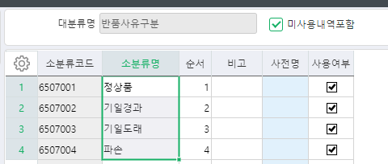
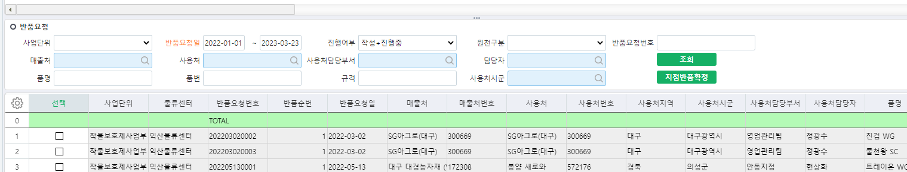

# 

1\. 지점반품확정입력 화면 1Sheet 마지막에 반품사유구분 컬럼 추가 요청 합니다. 

   Combo로 입력 할 수 있도록 추가 합니다. ( 필수아님 ) 



   hsg_TSLReturnReqItem ( UMOutType ) ( int )

  

 

2\. 지점반품확정입력 화면 2Sheet에서 반품요청에서 입력한 마스터비고, 품목비고 조회되도록 요청 합니다. 

 

