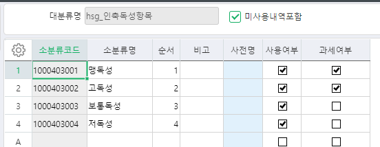
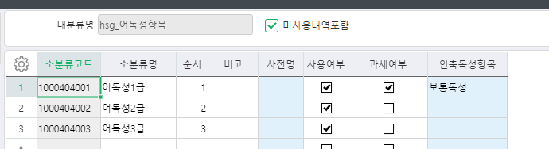

# 

품목조회 신규 개발 요청 합니다. 

 

작물보호품목과세여부_hsg 시트 추가 합니다.  

품목별 품목추가정보의 인축독성, 어독성 연결되어 있는 과세구분으로 품목과세여부_hsg 조회 합니다. 

 

품목 인축독성항목 : 맹독성, 고독성 , 보통독성 (보통독성 이면서 어독성의 경우 어독성1급인 경우) 

과세 

그 외에 품목 영세로 표시 

 

