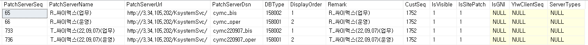
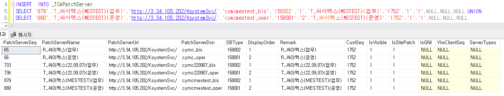
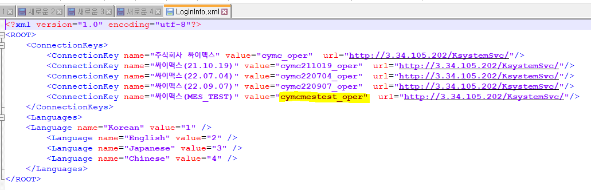

# 제뉴인 - DB 패치 서버 등록

+. 패치서버등록 화면에서 등록하면 된다

ERP 가 있다면 별도로 패치 테이블에 INSERT 후 패치 등록에서 패치할 수 있다

 

> SELECT \* FROM \_TCAPatchServer WHERE PatchServerName LIKE '%싸이맥스%'

 

 

SELECT MAX(PATCHSERVERSEQ) FROM \_TCAPatchServer

MAX 값 확인

 

 

+. PatchServerDsn 의 경우 DB명이 아니기 때문에 별도로 확인 필요

C:\Users\Public\Appdata\local\Younglimwon\KSystem ver.5 Genuine\싸이맥스-Genuine

=\> LoginInfo.xml 파일 확인

