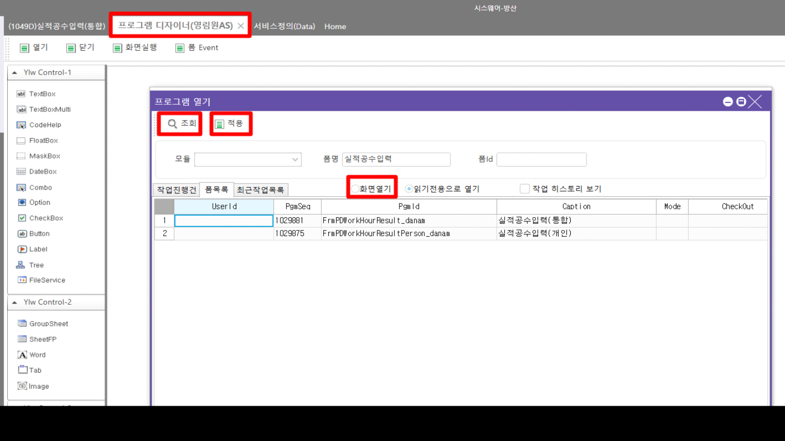
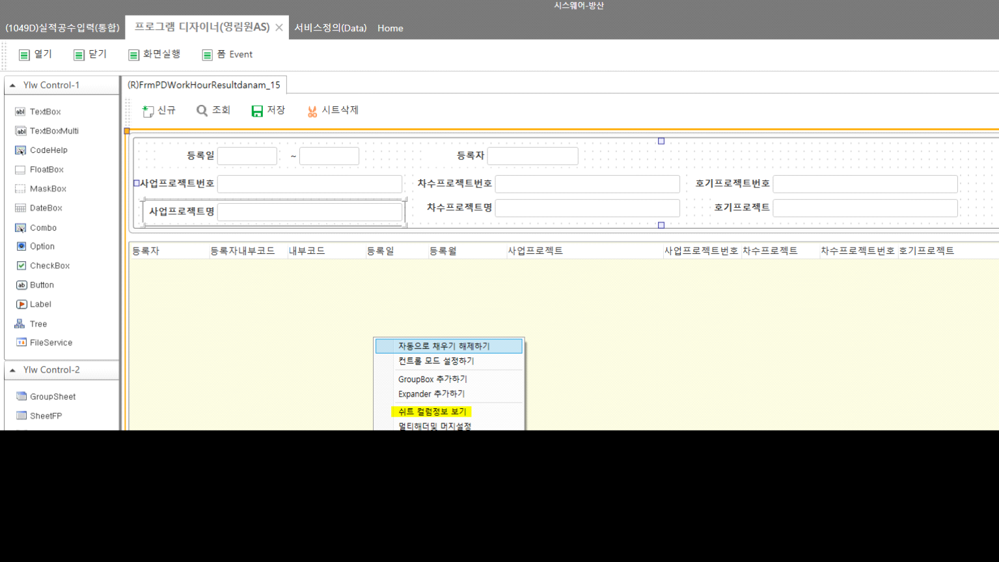
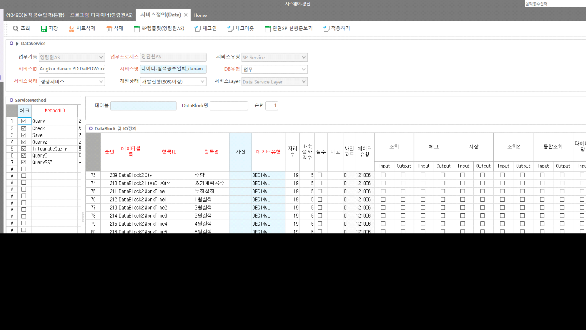

# 단암 개발툴

시스웨어-단암(TEMP)

<http://61.250.183.1:8400/KsystemSvc/>

<http://61.250.183.1:8200> 별도 설치 (실서버에서 개발해도 되긴함)

 

작업 후 패치는 원격들어가서 해야함

 

1번 DB의 DANAM이 여기 서버임

 

시스웨어-방산 접속

 

1.  프로그램 디자이너(영림원AS)

    1.  툴바 - 열기

    2.  화면 조회

    3.  화면열기 옵션 클릭 후 Active Row 설정 후 적용 툴바 클릭

 

 

 

 

 

2.  우클릭 - 쉬트 컬럼정보 보기 - 기존 개발툴과 동일하게 시트에 값 추가

 

> 
>
>  
>
>  

3.  조회 버튼 클릭 -\> \[프로그램 Method등록\] 다이얼로그 뜸 -\> 수정하려는 Service에 Active Row 설정 후 서비스 정의 툴바 클릭

>  
>
> 
>
>  
>
>  

4.  화면과 동일하게 체크아웃 후 컬럼 추가 =\> '행 헤더' 우클릭 후 항목 추가 클릭

    1.  간혹 동일한 값이 여러개 추가되는 경우가 있음 =\> 확인해보고 중복된 건 삭제

>  
>
> 
>
>  

5.  수정 후 화면, 서비스 모두 툴바 '적용하기' 클릭 및 체크인