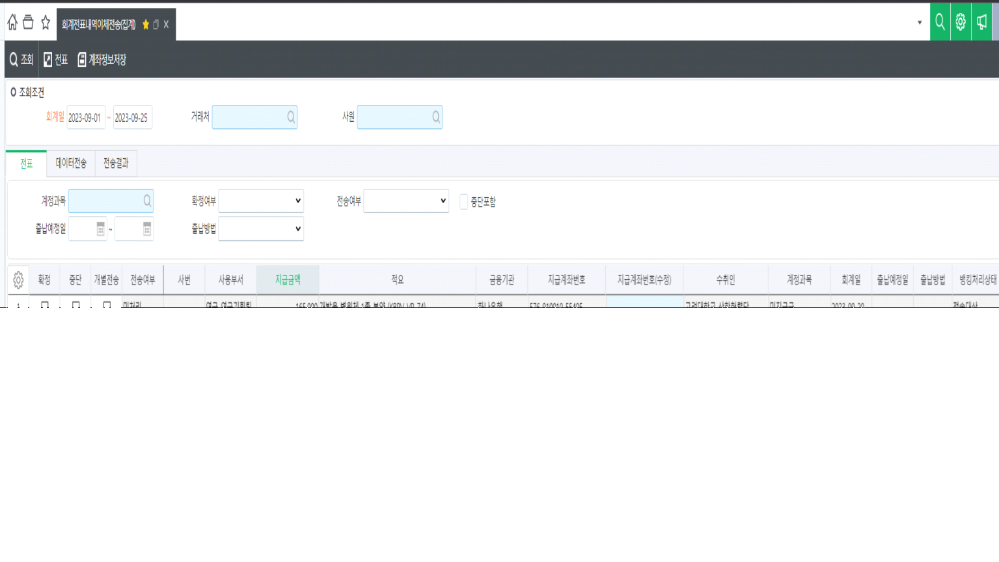

# 

**※ <u>ITGC 적용 스펙입니다. 테스트DB에만 적용 후 작성자와 상의 후 실DB에 적용하세요!</u> ※**

 

안녕하세요. 시스웨어 김현욱입니다.

회계내역이체전송(집계)화면에서 자금지출일지에서 생성된 출금전표만 조회되도록 적용 부탁드립니다.

일반분개전표는 조회되지 않도록 수정 붙가드립니다.

(대체서비스 생성되어 있습니다.)

 

확인 부탁드립니다.

감사합니다.

 

 

출처: \<<http://61.250.183.6:8100/Page/Open/44573/100101/0/18820244>\>