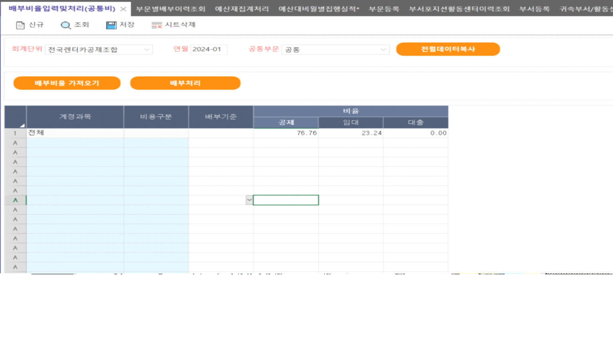

# 

- 요청

부서운영비(남부보상부), 부서운영비(중부보상부) 부서를 새로 추가하였는데 \[예산대비월별집행실적\*\] 화면에서 조회 시 부서운영비(남부보상부) 만 조회 되는 상태입니다.

전표처리와 예산부서에 대한 세팅도 되어있는 상태인데 \[예산대비월별집행실적\*\] 화면에서 부서운영비(남부보상부) 만 조회가 되지 않고 있기에 해당 부분 확인 요청 드립니다.

 

 

- 답변

<table style="width:100%;">
<colgroup>
<col style="width: 99%" />
</colgroup>
<thead>
<tr>
<th>
SP 상의 문제가 아닌 부문등록 화면에서 부서 및 활동센터 연결이 되어있지 않아서 발생한 문제입니다.

전표조건검색 화면에서 조회 시 나오는 부서, 활동센터를 등록한 후 배부비율입력및처리(공통비) 화면에서 배부처리 해주시면 됩니다.

확인부탁드립니다

 

 

</th>
</tr>
</thead>
<tbody>
</tbody>
</table>