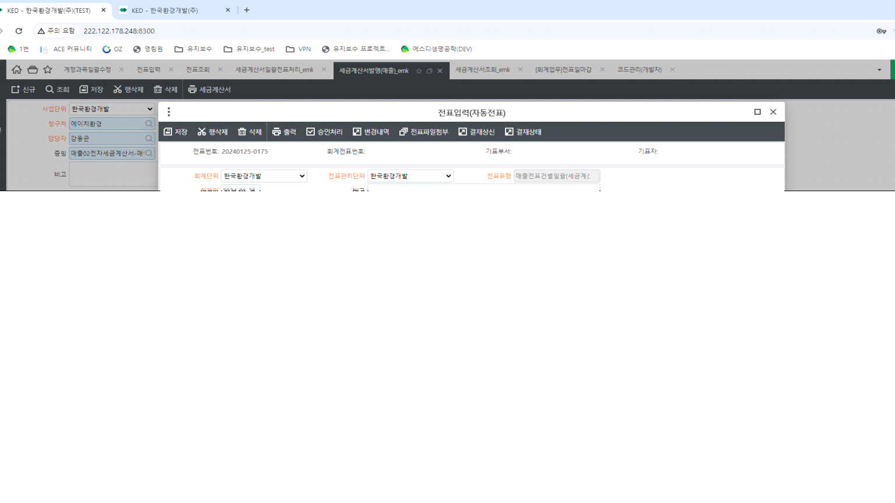

# 

안녕하세요. 개발팀 박성재 입니다.

\[세금계산서일괄전표처리_emk\] 화면에서 전표 행 중복 생성의 경우

금액이 존재하는 매출계정 관리항목 건과

금액 0인 운송계정 관리항목 건이 생성된 것으로 확인하였습니다.

전표 생성 시 (계정과목 - 금액0허용여부 미체크 건) 이면서 금액이 0인 건에 대해 제외하여 생성하지만,

'폐산폐알카리중화처리, 지정-수집운반' 계정과목의 경우 '금액0허용여부' 체크 이기 때문에 0금액으로 생성된 것으로 확인하였습니다.

'금액0허용여부' 체크 해제 시 0 금액 제외하여 데이터 생성되고 있습니다.

확인 부탁 드립니다.

 

감사합니다.



 







 

출처: \<<http://61.250.183.6:8100/Page/Open/55299/100101/0/18820244>\>